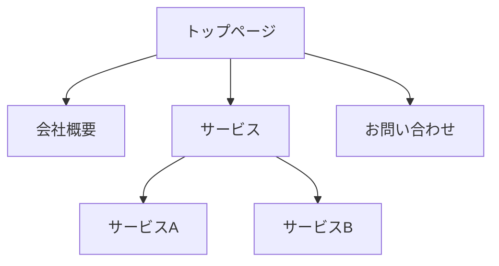

# ウェブサイト構造分析・ワイヤーフレーム作成

## 概要

指定されたURLからウェブサイトをクロールし、サイトマップ・ワイヤーフレーム・コンテンツ分析を作成する。

## 入力情報の確認

スキル実行時、以下を確認する：

### 1. 対象URL

- トップページのURLを取得
- ドメインを特定（クロール範囲の制限に使用）

### 2. クロール深度

ユーザーに確認：

- **1階層**: トップページから直接リンクされているページのみ
- **2階層**: トップ + その1つ下のページまで
- **3階層以上**: 必要に応じて指定
- **特定ページのみ**: URLリストを手動指定

### 3. サイトマップ出力形式（複数選択可）

- **Mermaid図**: 階層構造をツリー図で視覚化
- **Markdownリスト**: インデント付きリストで構造化
- **JSON**: プログラムで利用しやすい形式

### 4. ワイヤーフレーム出力形式（複数選択可）

- **Markdown + ASCII**: テキストベースで軽量
- **HTML/CSS**: ブラウザで確認可能な実際のワイヤーフレーム

### 5. コンテンツ分析（オプション）

- **なし**: ワイヤーフレームのみ
- **簡易分析**: ページ目的・ターゲット・主要メッセージ
- **詳細分析**: セクション別の目的・要約・キーワード・改善提案

## 実行フロー

### Step 1: サイトクロール

```text
mcp__plugin_playwright_playwright__browser_navigate
```

1. トップページにアクセス
2. ページ内のリンクを抽出
3. 同一ドメイン内のリンクをフィルタリング
4. 指定深度まで再帰的にクロール

**除外対象**:

- 外部ドメインへのリンク
- アンカーリンク（#で始まるもの）
- mailto:、tel:、javascript: 等
- 画像・PDF等のファイルリンク
- 重複URL

### Step 2: ページ構造の取得

各ページで以下を実行：

```text
mcp__plugin_playwright_playwright__browser_snapshot
```

スナップショットから抽出する情報：

- ヘッダー構造（h1〜h6）
- ナビゲーション要素
- メインコンテンツエリア
- サイドバー
- フッター
- フォーム要素
- ボタン・リンク
- 画像エリア

### Step 3: サイトマップ生成

#### Mermaid形式



#### Markdown形式

```markdown
- トップページ (/)
  - 会社概要 (/about)
  - サービス (/services)
    - サービスA (/services/a)
    - サービスB (/services/b)
  - お問い合わせ (/contact)
```

#### JSON形式

```json
{
  "url": "/",
  "title": "トップページ",
  "children": [
    {
      "url": "/about",
      "title": "会社概要",
      "children": []
    }
  ]
}
```

### Step 4: ワイヤーフレーム生成

#### Markdown + ASCII形式

```markdown
## ページ名: トップページ
URL: https://example.com/

### レイアウト構造

┌─────────────────────────────────────────┐
│ [HEADER]                                │
│ ┌─────┐ ┌─────────────────────────────┐ │
│ │Logo │ │ Nav: Home | About | Contact │ │
│ └─────┘ └─────────────────────────────┘ │
├─────────────────────────────────────────┤
│ [HERO]                                  │
│ ┌─────────────────────────────────────┐ │
│ │ H1: メインキャッチコピー            │ │
│ │ P: サブテキスト説明文               │ │
│ │ [CTA Button]                        │ │
│ └─────────────────────────────────────┘ │
├─────────────────────────────────────────┤
│ [MAIN CONTENT]                          │
│ ┌───────────┐ ┌───────────┐ ┌─────────┐ │
│ │ Card 1    │ │ Card 2    │ │ Card 3  │ │
│ │ [Image]   │ │ [Image]   │ │ [Image] │ │
│ │ Title     │ │ Title     │ │ Title   │ │
│ │ Text      │ │ Text      │ │ Text    │ │
│ └───────────┘ └───────────┘ └─────────┘ │
├─────────────────────────────────────────┤
│ [FOOTER]                                │
│ Copyright | Links | SNS Icons           │
└─────────────────────────────────────────┘

### 要素一覧

| エリア | 要素 | 内容 |
|--------|------|------|
| Header | Logo | 会社ロゴ |
| Header | Nav | 5項目のナビゲーション |
| Hero | H1 | メインキャッチコピー |
| Hero | Button | 「詳しく見る」CTA |
| Main | Cards | 3カラムのカード |
```

#### HTML/CSS形式

シンプルなHTMLワイヤーフレームを生成：

- グレースケール配色
- ボックスで要素を表現
- ラベルで要素種別を明示
- レスポンシブ対応（簡易版）

### Step 5: コンテンツ分析（オプション）

コンテンツ分析が選択された場合、以下を生成：

#### 簡易分析

```markdown
## コンテンツ分析サマリー

### ページの目的
[ページが達成しようとしている目標]

### ターゲットユーザー
[想定される読者・利用者]

### 主要メッセージ
> [ページが伝えたいコアメッセージ]
```

#### 詳細分析

```markdown
## コンテンツ分析サマリー

### ページの目的
[ページが達成しようとしている目標]

### ターゲットユーザー
- [ユーザー1]
- [ユーザー2]

### 主要メッセージ
> [ページが伝えたいコアメッセージ]

---

## セクション別コンテンツ分析

### 1. [セクション名]
| 項目 | 内容 |
|------|------|
| **目的** | このセクションの役割 |
| **コンテンツ要約** | 内容の要約（50-100文字） |
| **キーワード** | 重要なキーワード |
| **CTA** | 行動喚起の内容 |
| **差別化ポイント** | 競合との違い（あれば） |

### 2. [セクション名]
...

---

## インサイト・改善提案

### 強み
- [良い点1]
- [良い点2]

### 潜在的な改善点
- [改善提案1]
- [改善提案2]

### UX観点
- [ユーザー体験に関する所見]
```

#### 分析観点

コンテンツ分析では以下の観点で評価：

1. **目的の明確さ**: ページの目的が明確か
2. **ターゲット適合**: 想定ユーザーに適切な内容か
3. **メッセージの一貫性**: 主張が一貫しているか
4. **CTA の効果**: 行動喚起が適切か
5. **情報の構造化**: 情報が整理されているか
6. **差別化**: 競合との違いが伝わるか
7. **信頼性**: 数値・実績・第三者評価の有無

### Step 6: 出力

指定された形式でファイルを出力：

```
output/
├── sitemap.md              # サイトマップ（Mermaid）
├── sitemap.json            # サイトマップ（JSON）
├── wireframes/
│   ├── index.md            # トップページ
│   ├── about.md            # 会社概要
│   └── ...
├── wireframes-analyzed/    # 分析付き（詳細分析選択時）
│   ├── index.md
│   └── ...
└── wireframes-html/        # HTML形式の場合
    ├── index.html
    └── ...
```

## 注意事項

- **認証が必要なページ**: クロール不可。公開ページのみ対象
- **SPA（Single Page Application）**: 初期表示のみ取得可能
- **動的コンテンツ**: スナップショット時点の状態を取得
- **robots.txt**: 尊重し、disallowされているパスはスキップ
- **レート制限**: ページ間に適度な待機時間を設ける（1-2秒）
- **大規模サイト**: ページ数上限を設定（デフォルト20ページ）

## 出力ディレクトリ

ユーザーに確認するか、デフォルトでプロジェクトルートに `wireframe-output/` を作成。

## クイックスタート例

```
「https://example.com を分析して」

→ 以下を確認：
1. クロール深度: 1階層
2. サイトマップ: Mermaid
3. ワイヤーフレーム: Markdown + ASCII
4. コンテンツ分析: 詳細分析

→ 出力:
- sitemap.md
- wireframes/*.md（レイアウト + 分析付き）
```
