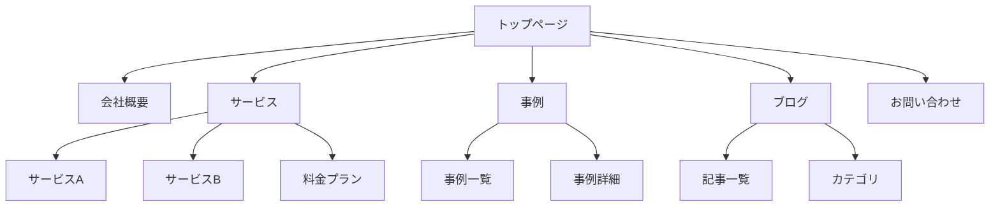

# ウェブサイト分析テンプレート集

このファイルは、ウェブサイト分析の出力テンプレートを提供します。

---

## 1. サイトマップ出力テンプレート

### Mermaid 形式



### Markdown リスト形式

```markdown
# サイトマップ

- トップページ (/)
  - 会社概要 (/about)
    - 代表挨拶 (/about/message)
    - 沿革 (/about/history)
    - アクセス (/about/access)
  - サービス (/services)
    - サービスA (/services/a)
    - サービスB (/services/b)
    - 料金プラン (/services/pricing)
  - 事例 (/case)
    - 事例一覧 (/case/list)
    - [各事例詳細ページ]
  - ブログ (/blog)
    - 記事一覧 (/blog/list)
    - [各記事詳細ページ]
  - お問い合わせ (/contact)
```

### JSON 形式

```json
{
  "sitemap": [
    {
      "url": "/",
      "title": "トップページ",
      "depth": 0,
      "children": [
        {
          "url": "/about",
          "title": "会社概要",
          "depth": 1,
          "children": [
            { "url": "/about/message", "title": "代表挨拶", "depth": 2 },
            { "url": "/about/history", "title": "沿革", "depth": 2 }
          ]
        },
        {
          "url": "/services",
          "title": "サービス",
          "depth": 1,
          "children": []
        }
      ]
    }
  ],
  "meta": {
    "totalPages": 25,
    "maxDepth": 3,
    "crawledAt": "2024-01-15T10:00:00Z"
  }
}
```

---

## 2. ワイヤーフレーム出力テンプレート

### ASCII ワイヤーフレーム

```markdown
# ページ: トップページ
URL: https://example.com/

## レイアウト構造

┌─────────────────────────────────────────────────────────────┐
│ [HEADER]                                                     │
│ ┌───────┐  ┌─────────────────────────────────────────────┐  │
│ │ Logo  │  │ Nav: Home | Service | Case | Blog | Contact │  │
│ └───────┘  └─────────────────────────────────────────────┘  │
├─────────────────────────────────────────────────────────────┤
│ [HERO SECTION]                                               │
│ ┌─────────────────────────────────────────────────────────┐ │
│ │                                                         │ │
│ │  H1: キャッチコピー                                     │ │
│ │  P: サブテキスト説明文がここに入ります                  │ │
│ │                                                         │ │
│ │  [CTA Button: お問い合わせ]  [Secondary: 詳しく見る]    │ │
│ │                                                         │ │
│ └─────────────────────────────────────────────────────────┘ │
├─────────────────────────────────────────────────────────────┤
│ [FEATURES SECTION]                                           │
│                                                              │
│ H2: サービスの特徴                                           │
│                                                              │
│ ┌─────────────┐  ┌─────────────┐  ┌─────────────┐          │
│ │   [Icon]    │  │   [Icon]    │  │   [Icon]    │          │
│ │   Feature1  │  │   Feature2  │  │   Feature3  │          │
│ │   説明文    │  │   説明文    │  │   説明文    │          │
│ └─────────────┘  └─────────────┘  └─────────────┘          │
├─────────────────────────────────────────────────────────────┤
│ [CASE SECTION]                                               │
│                                                              │
│ H2: 導入事例                                                 │
│                                                              │
│ ┌─────────────────────────┐  ┌─────────────────────────┐   │
│ │ [Image]                 │  │ [Image]                 │   │
│ │ 事例タイトル1           │  │ 事例タイトル2           │   │
│ │ 業種: IT                │  │ 業種: 製造              │   │
│ └─────────────────────────┘  └─────────────────────────┘   │
├─────────────────────────────────────────────────────────────┤
│ [CTA SECTION]                                                │
│ ┌─────────────────────────────────────────────────────────┐ │
│ │  H2: お気軽にご相談ください                             │ │
│ │  [CTA Button: 無料相談を予約する]                       │ │
│ └─────────────────────────────────────────────────────────┘ │
├─────────────────────────────────────────────────────────────┤
│ [FOOTER]                                                     │
│ ┌───────────────┐  ┌───────────────┐  ┌───────────────┐    │
│ │ Company Info  │  │ Quick Links   │  │ SNS           │    │
│ │ - 会社名      │  │ - サービス    │  │ - Twitter     │    │
│ │ - 住所        │  │ - 事例        │  │ - Facebook    │    │
│ │ - 電話        │  │ - ブログ      │  │ - LinkedIn    │    │
│ └───────────────┘  └───────────────┘  └───────────────┘    │
│                                                              │
│ Copyright © 2024 Company Name. All rights reserved.          │
└─────────────────────────────────────────────────────────────┘

## 要素一覧

| エリア | 要素 | 内容 | 備考 |
|--------|------|------|------|
| Header | Logo | 会社ロゴ | クリックでトップへ |
| Header | Nav | 5項目 | レスポンシブでハンバーガー |
| Hero | H1 | メインキャッチコピー | 40px, Bold |
| Hero | P | サブテキスト | 18px |
| Hero | CTA | 2つのボタン | Primary + Ghost |
| Features | H2 | セクション見出し | 32px |
| Features | Cards | 3カラムカード | アイコン + テキスト |
| Case | Cards | 2カラム事例 | 画像 + メタ情報 |
| CTA | H2 | アクション誘導 | 背景色付き |
| Footer | 3カラム | 会社情報, リンク, SNS | |
```

---

## 3. コンテンツ分析テンプレート

### 簡易分析

```markdown
# コンテンツ分析サマリー

## 基本情報
- **URL**: https://example.com/
- **ページタイトル**: [タイトル]
- **分析日**: YYYY-MM-DD

---

## ページの目的

[このページが達成しようとしている主な目標を1-2文で記述]

例: 製品の認知向上と問い合わせ獲得を目的としたランディングページ

---

## ターゲットユーザー

[想定される主要な読者・利用者]

例: 中小企業の経営者、IT部門の意思決定者

---

## 主要メッセージ

> [ページが伝えたいコアメッセージを引用形式で]

例: "業務効率を50%改善する唯一のソリューション"
```

### 詳細分析

```markdown
# コンテンツ詳細分析

## 基本情報
- **URL**: https://example.com/
- **ページタイトル**: [タイトル]
- **分析日**: YYYY-MM-DD
- **ページタイプ**: LP / サービス紹介 / ブログ / 会社概要

---

## エグゼクティブサマリー

| 項目 | 評価 | コメント |
|------|------|----------|
| 目的の明確さ | ⭐⭐⭐⭐☆ | [コメント] |
| ターゲット適合 | ⭐⭐⭐☆☆ | [コメント] |
| メッセージの一貫性 | ⭐⭐⭐⭐⭐ | [コメント] |
| CTA の効果 | ⭐⭐⭐☆☆ | [コメント] |
| 情報の構造化 | ⭐⭐⭐⭐☆ | [コメント] |

---

## ページの目的

[詳細な目的の分析]

**プライマリゴール**: [主要目標]
**セカンダリゴール**: [副次目標]

---

## ターゲットユーザー

### プライマリターゲット
- **属性**: [年齢、職業、役職など]
- **課題**: [抱えている問題]
- **動機**: [このページを訪れる理由]

### セカンダリターゲット
- **属性**: [年齢、職業、役職など]
- **課題**: [抱えている問題]

---

## セクション別コンテンツ分析

### 1. ヒーローセクション

| 項目 | 内容 |
|------|------|
| **目的** | ファーストビューで価値を伝え、スクロールを促す |
| **コンテンツ要約** | [50-100文字で要約] |
| **キーワード** | [重要なキーワード] |
| **CTA** | [行動喚起の内容] |
| **差別化ポイント** | [競合との違い] |

**評価**: ⭐⭐⭐⭐☆
**改善提案**: [具体的な改善提案]

### 2. 特徴セクション

| 項目 | 内容 |
|------|------|
| **目的** | 製品/サービスの主要な価値を伝える |
| **コンテンツ要約** | [要約] |
| **キーワード** | [キーワード] |

**評価**: ⭐⭐⭐☆☆
**改善提案**: [改善提案]

---

## インサイト・改善提案

### 強み
- [良い点1]
- [良い点2]
- [良い点3]

### 潜在的な改善点
- [改善提案1]
- [改善提案2]
- [改善提案3]

### UX観点
- [ユーザー体験に関する所見1]
- [ユーザー体験に関する所見2]

---

## 競合比較（オプション）

| 項目 | 自社 | 競合A | 競合B |
|------|------|-------|-------|
| メインメッセージ | [内容] | [内容] | [内容] |
| 差別化ポイント | [内容] | [内容] | [内容] |
| CTA | [内容] | [内容] | [内容] |
```

---

## 4. デザイン分析テンプレート

### 基本分析

```markdown
# デザインシステム分析レポート

**対象サイト**: https://example.com/
**分析日**: YYYY-MM-DD

---

## カラーパレット

### プライマリカラー

| 用途 | 値 | RGB | プレビュー |
|------|-----|-----|-----------|
| Primary | #3B82F6 | rgb(59, 130, 246) | 🟦 |
| Secondary | #8B5CF6 | rgb(139, 92, 246) | 🟪 |
| Accent | #F59E0B | rgb(245, 158, 11) | 🟧 |

### ニュートラルカラー

| 用途 | 値 | RGB | プレビュー |
|------|-----|-----|-----------|
| Background | #FFFFFF | rgb(255, 255, 255) | ⬜ |
| Surface | #F9FAFB | rgb(249, 250, 251) | ⬜ |
| Text Primary | #111827 | rgb(17, 24, 39) | ⬛ |
| Text Secondary | #6B7280 | rgb(107, 114, 128) | ⬛ |
| Border | #E5E7EB | rgb(229, 231, 235) | ⬜ |

### セマンティックカラー

| 用途 | 値 | RGB | プレビュー |
|------|-----|-----|-----------|
| Success | #10B981 | rgb(16, 185, 129) | 🟢 |
| Warning | #F59E0B | rgb(245, 158, 11) | 🟡 |
| Error | #EF4444 | rgb(239, 68, 68) | 🔴 |
| Info | #3B82F6 | rgb(59, 130, 246) | 🔵 |

---

## タイポグラフィ

### フォントファミリー

- **Primary**: 'Inter', -apple-system, BlinkMacSystemFont, 'Segoe UI', sans-serif
- **Secondary**: 'Roboto Mono', monospace
- **Heading**: 'Inter', sans-serif

### フォントサイズスケール

| 用途 | サイズ | ウェイト | 行高 | 用途例 |
|------|--------|----------|------|--------|
| h1 | 48px | 700 | 1.2 | ページタイトル |
| h2 | 36px | 700 | 1.3 | セクション見出し |
| h3 | 24px | 600 | 1.4 | サブセクション |
| h4 | 20px | 600 | 1.5 | カード見出し |
| body-lg | 18px | 400 | 1.6 | リード文 |
| body | 16px | 400 | 1.6 | 本文 |
| body-sm | 14px | 400 | 1.5 | 補足テキスト |
| caption | 12px | 400 | 1.4 | キャプション |

---

## スペーシングスケール

### 検出された値（px）

```
4, 8, 12, 16, 20, 24, 32, 40, 48, 64, 80, 96
```

### 推奨スケール（8pxベース）

| トークン | 値 | 用途例 |
|----------|-----|--------|
| xs | 4px | アイコン間隔 |
| sm | 8px | 要素間の最小間隔 |
| md | 16px | 標準的な要素間隔 |
| lg | 24px | セクション内の間隔 |
| xl | 32px | セクション間の間隔 |
| 2xl | 48px | 大きなセクション間隔 |
| 3xl | 64px | ページ上下の余白 |

---

## コンポーネントサイズ

### ボタン

| サイズ | 高さ | パディング | フォント | 用途 |
|--------|------|-----------|----------|------|
| sm | 32px | 12px 16px | 14px | 補助アクション |
| md | 40px | 12px 24px | 16px | 標準ボタン |
| lg | 48px | 16px 32px | 18px | プライマリCTA |

### インプット

| サイズ | 高さ | パディング | フォント |
|--------|------|-----------|----------|
| sm | 32px | 8px 12px | 14px |
| md | 40px | 10px 16px | 16px |
| lg | 48px | 12px 20px | 18px |

### カード

| サイズ | 幅 | パディング | ボーダー半径 |
|--------|-----|-----------|--------------|
| sm | 280px | 16px | 8px |
| md | 320px | 24px | 12px |
| lg | 400px | 32px | 16px |
```

### 詳細分析（CSS変数出力付き）

```markdown
# デザインシステム分析レポート（詳細版）

**対象サイト**: https://example.com/
**分析日**: YYYY-MM-DD

---

## エグゼクティブサマリー

| 項目 | 評価 | コメント |
|------|------|----------|
| カラーシステムの一貫性 | ⭐⭐⭐⭐☆ | 統一されたパレット、一部ハードコーディング有り |
| タイポグラフィ体系 | ⭐⭐⭐☆☆ | フォントサイズは規則的、ウェイトの使い分けが不明瞭 |
| スペーシングの規則性 | ⭐⭐⭐⭐⭐ | 8pxベースで一貫したスケール |
| コンポーネントサイズ | ⭐⭐⭐☆☆ | 標準的なサイズだが、sm/md/lgの定義が曖昧 |

---

## カラーパレット

[基本分析と同じ]

---

## タイポグラフィ

[基本分析と同じ]

---

## スペーシングスケール

[基本分析と同じ]

---

## コンポーネントサイズ

[基本分析と同じ]

---

## ボーダー・シャドウ

### ボーダー半径

| トークン | 値 | 用途 |
|----------|-----|------|
| sm | 4px | 小さな要素 |
| md | 8px | ボタン、インプット |
| lg | 12px | カード |
| xl | 16px | モーダル |
| full | 9999px | ピル型ボタン |

### ボックスシャドウ

| トークン | 値 | 用途 |
|----------|-----|------|
| sm | 0 1px 2px rgba(0,0,0,0.05) | 浮き出し効果 |
| md | 0 4px 6px rgba(0,0,0,0.1) | カード |
| lg | 0 10px 15px rgba(0,0,0,0.1) | ドロップダウン |
| xl | 0 20px 25px rgba(0,0,0,0.15) | モーダル |

---

## CSS変数形式（デザイントークン）

### colors.css

\`\`\`css
:root {
  /* Primary Colors */
  --color-primary: #3B82F6;
  --color-primary-rgb: 59, 130, 246;
  --color-secondary: #8B5CF6;
  --color-secondary-rgb: 139, 92, 246;
  --color-accent: #F59E0B;
  --color-accent-rgb: 245, 158, 11;

  /* Neutral Colors */
  --color-background: #FFFFFF;
  --color-surface: #F9FAFB;
  --color-text-primary: #111827;
  --color-text-secondary: #6B7280;
  --color-border: #E5E7EB;

  /* Semantic Colors */
  --color-success: #10B981;
  --color-warning: #F59E0B;
  --color-error: #EF4444;
  --color-info: #3B82F6;
}
\`\`\`

### typography.css

\`\`\`css
:root {
  /* Font Families */
  --font-primary: 'Inter', -apple-system, BlinkMacSystemFont, 'Segoe UI', sans-serif;
  --font-secondary: 'Roboto Mono', monospace;
  --font-heading: 'Inter', sans-serif;

  /* Font Sizes */
  --font-size-h1: 48px;
  --font-size-h2: 36px;
  --font-size-h3: 24px;
  --font-size-h4: 20px;
  --font-size-body-lg: 18px;
  --font-size-body: 16px;
  --font-size-body-sm: 14px;
  --font-size-caption: 12px;

  /* Font Weights */
  --font-weight-regular: 400;
  --font-weight-medium: 500;
  --font-weight-semibold: 600;
  --font-weight-bold: 700;

  /* Line Heights */
  --line-height-tight: 1.2;
  --line-height-normal: 1.5;
  --line-height-relaxed: 1.6;
}
\`\`\`

### spacing.css

\`\`\`css
:root {
  /* Spacing Scale (8px base) */
  --spacing-xs: 4px;
  --spacing-sm: 8px;
  --spacing-md: 16px;
  --spacing-lg: 24px;
  --spacing-xl: 32px;
  --spacing-2xl: 48px;
  --spacing-3xl: 64px;
  --spacing-4xl: 80px;
  --spacing-5xl: 96px;
}
\`\`\`

### components.css

\`\`\`css
:root {
  /* Button Sizes */
  --button-height-sm: 32px;
  --button-height-md: 40px;
  --button-height-lg: 48px;
  --button-padding-sm: 12px 16px;
  --button-padding-md: 12px 24px;
  --button-padding-lg: 16px 32px;

  /* Input Sizes */
  --input-height-sm: 32px;
  --input-height-md: 40px;
  --input-height-lg: 48px;

  /* Border Radius */
  --radius-sm: 4px;
  --radius-md: 8px;
  --radius-lg: 12px;
  --radius-xl: 16px;
  --radius-full: 9999px;

  /* Shadows */
  --shadow-sm: 0 1px 2px rgba(0, 0, 0, 0.05);
  --shadow-md: 0 4px 6px rgba(0, 0, 0, 0.1);
  --shadow-lg: 0 10px 15px rgba(0, 0, 0, 0.1);
  --shadow-xl: 0 20px 25px rgba(0, 0, 0, 0.15);
}
\`\`\`

---

## 実装推奨事項

### 1. デザイントークンの統一

現在のサイトでは一部のスタイルがハードコーディングされています。CSS変数を導入することで保守性が向上します。

### 2. カラーパレットの整理

検出された色の中には、微妙に異なる値（例: #111827 と #1F2937）が複数存在します。統一することでブランド一貫性が向上します。

### 3. スペーシングの標準化

8pxベースのスケールが検出されましたが、一部で12px、20pxなどの非標準値が使用されています。スケールへの統一を推奨します。

### 4. タイポグラフィの階層

フォントウェイトの使い分けが不明瞭です。見出しと本文で明確な差をつけることでヒエラルキーが明確になります。

---

## 活用方法

### デザインシステムの構築

このレポートをベースに、デザインシステムを構築できます：

1. CSS変数を`design-tokens.css`として保存
2. UIコンポーネントライブラリ（Tailwind、Chakra UI等）の設定に反映
3. デザインツール（Figma、Sketch）でスタイルガイドを作成

### 新規実装への適用

既存サイトのデザインパターンを踏襲しつつ、新規ページやコンポーネントを実装できます。
\`\`\`
```

---

## 5. 統合レポートテンプレート

```markdown
# ウェブサイト分析レポート

**対象サイト**: https://example.com/
**分析日**: YYYY-MM-DD
**分析範囲**: [クロール深度・ページ数]

---

## エグゼクティブサマリー

[全体の要約を3-5文で]

---

## サイト構造

### サイトマップ

[Mermaid図またはリスト]

### ページ構成統計

| 項目 | 値 |
|------|-----|
| 総ページ数 | XX |
| 最大深度 | X |
| 孤立ページ | X |
| 外部リンク数 | XX |

---

## 主要ページ分析

### トップページ
[ワイヤーフレーム + コンテンツ分析]

### サービスページ
[ワイヤーフレーム + コンテンツ分析]

---

## 総合評価

| カテゴリ | 評価 | コメント |
|----------|------|----------|
| 情報アーキテクチャ | ⭐⭐⭐⭐☆ | [コメント] |
| ユーザーフロー | ⭐⭐⭐☆☆ | [コメント] |
| コンテンツ品質 | ⭐⭐⭐⭐☆ | [コメント] |
| CTA設計 | ⭐⭐⭐☆☆ | [コメント] |

---

## 改善提案

### 優先度: 高
1. [改善提案1]
2. [改善提案2]

### 優先度: 中
1. [改善提案3]
2. [改善提案4]

### 優先度: 低
1. [改善提案5]
```
