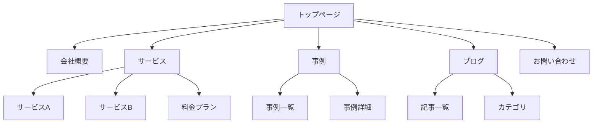

# ウェブサイト分析テンプレート集

このファイルは、ウェブサイト分析の出力テンプレートを提供します。

---

## 1. サイトマップ出力テンプレート

### Mermaid 形式



### Markdown リスト形式

```markdown
# サイトマップ

- トップページ (/)
  - 会社概要 (/about)
    - 代表挨拶 (/about/message)
    - 沿革 (/about/history)
    - アクセス (/about/access)
  - サービス (/services)
    - サービスA (/services/a)
    - サービスB (/services/b)
    - 料金プラン (/services/pricing)
  - 事例 (/case)
    - 事例一覧 (/case/list)
    - [各事例詳細ページ]
  - ブログ (/blog)
    - 記事一覧 (/blog/list)
    - [各記事詳細ページ]
  - お問い合わせ (/contact)
```

### JSON 形式

```json
{
  "sitemap": [
    {
      "url": "/",
      "title": "トップページ",
      "depth": 0,
      "children": [
        {
          "url": "/about",
          "title": "会社概要",
          "depth": 1,
          "children": [
            { "url": "/about/message", "title": "代表挨拶", "depth": 2 },
            { "url": "/about/history", "title": "沿革", "depth": 2 }
          ]
        },
        {
          "url": "/services",
          "title": "サービス",
          "depth": 1,
          "children": []
        }
      ]
    }
  ],
  "meta": {
    "totalPages": 25,
    "maxDepth": 3,
    "crawledAt": "2024-01-15T10:00:00Z"
  }
}
```

---

## 2. ワイヤーフレーム出力テンプレート

### ASCII ワイヤーフレーム

```markdown
# ページ: トップページ
URL: https://example.com/

## レイアウト構造

┌─────────────────────────────────────────────────────────────┐
│ [HEADER]                                                     │
│ ┌───────┐  ┌─────────────────────────────────────────────┐  │
│ │ Logo  │  │ Nav: Home | Service | Case | Blog | Contact │  │
│ └───────┘  └─────────────────────────────────────────────┘  │
├─────────────────────────────────────────────────────────────┤
│ [HERO SECTION]                                               │
│ ┌─────────────────────────────────────────────────────────┐ │
│ │                                                         │ │
│ │  H1: キャッチコピー                                     │ │
│ │  P: サブテキスト説明文がここに入ります                  │ │
│ │                                                         │ │
│ │  [CTA Button: お問い合わせ]  [Secondary: 詳しく見る]    │ │
│ │                                                         │ │
│ └─────────────────────────────────────────────────────────┘ │
├─────────────────────────────────────────────────────────────┤
│ [FEATURES SECTION]                                           │
│                                                              │
│ H2: サービスの特徴                                           │
│                                                              │
│ ┌─────────────┐  ┌─────────────┐  ┌─────────────┐          │
│ │   [Icon]    │  │   [Icon]    │  │   [Icon]    │          │
│ │   Feature1  │  │   Feature2  │  │   Feature3  │          │
│ │   説明文    │  │   説明文    │  │   説明文    │          │
│ └─────────────┘  └─────────────┘  └─────────────┘          │
├─────────────────────────────────────────────────────────────┤
│ [CASE SECTION]                                               │
│                                                              │
│ H2: 導入事例                                                 │
│                                                              │
│ ┌─────────────────────────┐  ┌─────────────────────────┐   │
│ │ [Image]                 │  │ [Image]                 │   │
│ │ 事例タイトル1           │  │ 事例タイトル2           │   │
│ │ 業種: IT                │  │ 業種: 製造              │   │
│ └─────────────────────────┘  └─────────────────────────┘   │
├─────────────────────────────────────────────────────────────┤
│ [CTA SECTION]                                                │
│ ┌─────────────────────────────────────────────────────────┐ │
│ │  H2: お気軽にご相談ください                             │ │
│ │  [CTA Button: 無料相談を予約する]                       │ │
│ └─────────────────────────────────────────────────────────┘ │
├─────────────────────────────────────────────────────────────┤
│ [FOOTER]                                                     │
│ ┌───────────────┐  ┌───────────────┐  ┌───────────────┐    │
│ │ Company Info  │  │ Quick Links   │  │ SNS           │    │
│ │ - 会社名      │  │ - サービス    │  │ - Twitter     │    │
│ │ - 住所        │  │ - 事例        │  │ - Facebook    │    │
│ │ - 電話        │  │ - ブログ      │  │ - LinkedIn    │    │
│ └───────────────┘  └───────────────┘  └───────────────┘    │
│                                                              │
│ Copyright © 2024 Company Name. All rights reserved.          │
└─────────────────────────────────────────────────────────────┘

## 要素一覧

| エリア | 要素 | 内容 | 備考 |
|--------|------|------|------|
| Header | Logo | 会社ロゴ | クリックでトップへ |
| Header | Nav | 5項目 | レスポンシブでハンバーガー |
| Hero | H1 | メインキャッチコピー | 40px, Bold |
| Hero | P | サブテキスト | 18px |
| Hero | CTA | 2つのボタン | Primary + Ghost |
| Features | H2 | セクション見出し | 32px |
| Features | Cards | 3カラムカード | アイコン + テキスト |
| Case | Cards | 2カラム事例 | 画像 + メタ情報 |
| CTA | H2 | アクション誘導 | 背景色付き |
| Footer | 3カラム | 会社情報, リンク, SNS | |
```

---

## 3. コンテンツ分析テンプレート

### 簡易分析

```markdown
# コンテンツ分析サマリー

## 基本情報
- **URL**: https://example.com/
- **ページタイトル**: [タイトル]
- **分析日**: YYYY-MM-DD

---

## ページの目的

[このページが達成しようとしている主な目標を1-2文で記述]

例: 製品の認知向上と問い合わせ獲得を目的としたランディングページ

---

## ターゲットユーザー

[想定される主要な読者・利用者]

例: 中小企業の経営者、IT部門の意思決定者

---

## 主要メッセージ

> [ページが伝えたいコアメッセージを引用形式で]

例: "業務効率を50%改善する唯一のソリューション"
```

### 詳細分析

```markdown
# コンテンツ詳細分析

## 基本情報
- **URL**: https://example.com/
- **ページタイトル**: [タイトル]
- **分析日**: YYYY-MM-DD
- **ページタイプ**: LP / サービス紹介 / ブログ / 会社概要

---

## エグゼクティブサマリー

| 項目 | 評価 | コメント |
|------|------|----------|
| 目的の明確さ | ⭐⭐⭐⭐☆ | [コメント] |
| ターゲット適合 | ⭐⭐⭐☆☆ | [コメント] |
| メッセージの一貫性 | ⭐⭐⭐⭐⭐ | [コメント] |
| CTA の効果 | ⭐⭐⭐☆☆ | [コメント] |
| 情報の構造化 | ⭐⭐⭐⭐☆ | [コメント] |

---

## ページの目的

[詳細な目的の分析]

**プライマリゴール**: [主要目標]
**セカンダリゴール**: [副次目標]

---

## ターゲットユーザー

### プライマリターゲット
- **属性**: [年齢、職業、役職など]
- **課題**: [抱えている問題]
- **動機**: [このページを訪れる理由]

### セカンダリターゲット
- **属性**: [年齢、職業、役職など]
- **課題**: [抱えている問題]

---

## セクション別コンテンツ分析

### 1. ヒーローセクション

| 項目 | 内容 |
|------|------|
| **目的** | ファーストビューで価値を伝え、スクロールを促す |
| **コンテンツ要約** | [50-100文字で要約] |
| **キーワード** | [重要なキーワード] |
| **CTA** | [行動喚起の内容] |
| **差別化ポイント** | [競合との違い] |

**評価**: ⭐⭐⭐⭐☆
**改善提案**: [具体的な改善提案]

### 2. 特徴セクション

| 項目 | 内容 |
|------|------|
| **目的** | 製品/サービスの主要な価値を伝える |
| **コンテンツ要約** | [要約] |
| **キーワード** | [キーワード] |

**評価**: ⭐⭐⭐☆☆
**改善提案**: [改善提案]

---

## インサイト・改善提案

### 強み
- [良い点1]
- [良い点2]
- [良い点3]

### 潜在的な改善点
- [改善提案1]
- [改善提案2]
- [改善提案3]

### UX観点
- [ユーザー体験に関する所見1]
- [ユーザー体験に関する所見2]

---

## 競合比較（オプション）

| 項目 | 自社 | 競合A | 競合B |
|------|------|-------|-------|
| メインメッセージ | [内容] | [内容] | [内容] |
| 差別化ポイント | [内容] | [内容] | [内容] |
| CTA | [内容] | [内容] | [内容] |
```

---

## 4. 統合レポートテンプレート

```markdown
# ウェブサイト分析レポート

**対象サイト**: https://example.com/
**分析日**: YYYY-MM-DD
**分析範囲**: [クロール深度・ページ数]

---

## エグゼクティブサマリー

[全体の要約を3-5文で]

---

## サイト構造

### サイトマップ

[Mermaid図またはリスト]

### ページ構成統計

| 項目 | 値 |
|------|-----|
| 総ページ数 | XX |
| 最大深度 | X |
| 孤立ページ | X |
| 外部リンク数 | XX |

---

## 主要ページ分析

### トップページ
[ワイヤーフレーム + コンテンツ分析]

### サービスページ
[ワイヤーフレーム + コンテンツ分析]

---

## 総合評価

| カテゴリ | 評価 | コメント |
|----------|------|----------|
| 情報アーキテクチャ | ⭐⭐⭐⭐☆ | [コメント] |
| ユーザーフロー | ⭐⭐⭐☆☆ | [コメント] |
| コンテンツ品質 | ⭐⭐⭐⭐☆ | [コメント] |
| CTA設計 | ⭐⭐⭐☆☆ | [コメント] |

---

## 改善提案

### 優先度: 高
1. [改善提案1]
2. [改善提案2]

### 優先度: 中
1. [改善提案3]
2. [改善提案4]

### 優先度: 低
1. [改善提案5]
```
