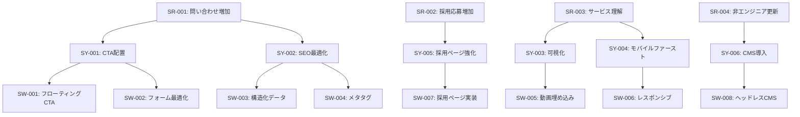

# defining-requirements

国際規格に準拠したウェブ制作向け要件定義スキル

## <objective>

### 目的

ウェブ制作プロジェクトにおける要件定義の属人化を防ぎ、体系的で漏れのない要件を整理します。

**このスキルが解決する課題:**

1. **属人化の問題**
   - ヒアリング結果が個人のメモに留まる
   - 要件の抜け漏れが後工程で発覚
   - 担当者が変わると要件が分からなくなる

2. **構造化の欠如**
   - 「誰のため」「何を解決」「どう実現」が混在
   - 優先順位が不明確
   - トレーサビリティがない

3. **品質観点の漏れ**
   - 機能要件に偏り、非機能要件が後回し
   - パフォーマンス、セキュリティ、アクセシビリティが未定義

### 採用する国際規格

#### ISO/IEC/IEEE 29148 - 要件の3階層構造

```
ステークホルダ要件（SR）
  ↓ なぜ必要か、誰のためか
システム要件（SY）
  ↓ どう解決するか
ソフトウェア要件（SW）
  ↓ 具体的に何を作るか
```

**トレーサビリティ:**
- 各要件にID付与（SR-001、SY-001、SW-001）
- 階層間の関連を明記
- 変更時の影響範囲を追跡可能

#### ISO/IEC 25010 - ソフトウェア品質特性

**8つの品質特性:**

1. 機能適合性 - 必要な機能を提供しているか
2. 性能効率性 - 速度、メモリ、リソース効率
3. 互換性 - ブラウザ、デバイス、既存システムとの統合
4. 使用性 - UI/UX、学習コスト、アクセシビリティ
5. 信頼性 - 可用性、障害許容性、回復性
6. セキュリティ - 認証、暗号化、データ保護
7. 保守性 - コード品質、拡張性、テスト容易性
8. 移植性 - 環境依存、デプロイ容易性

**重要:** 全ての品質特性を満たす必要はない。プロジェクトの優先度に応じて選択する。

---

## <quick_start>

### すぐに使う - 3ステップ

#### Step 1: ヒアリング結果を入力

```
【入力例】
クライアント: "問い合わせが少ないのでサイトをリニューアルしたい"
ユーザー調査: "製品情報が探しにくい、スマホで見づらい"
```

#### Step 2: 3階層に分類

スキルが自動的に以下のように整理します:

```markdown
## ステークホルダ要件
| ID | ステークホルダ | ニーズ | 優先度 |
|----|----------------|--------|--------|
| SR-001 | 経営者 | 問い合わせ増加 | 高 |
| SR-002 | エンドユーザー | 製品情報を素早く見つけたい | 高 |
| SR-003 | エンドユーザー | スマホで快適に閲覧したい | 高 |

## システム要件
| ID | 関連SR | 要件 | 実現方法 |
|----|--------|------|----------|
| SY-001 | SR-001 | CTAを全ページに配置 | UI設計 |
| SY-002 | SR-002 | 検索機能の追加 | サイト内検索 |
| SY-003 | SR-003 | レスポンシブ対応 | モバイルファースト設計 |

## ソフトウェア要件
| ID | 関連SY | 具体的な仕様 | 受入条件 |
|----|--------|--------------|----------|
| SW-001 | SY-001 | フローティングCTAボタン | 3秒以内に表示 |
| SW-002 | SY-002 | Algolia検索エンジン統合 | 1秒以内に結果表示 |
| SW-003 | SY-003 | 375px〜1920px対応 | 全画面サイズで崩れなし |
```

#### Step 3: 品質特性チェック

スキルが品質特性チェックリストを出力します:

```markdown
## 品質要件（ISO 25010）
| 品質特性 | 要件 | 優先度 | 根拠 |
|----------|------|--------|------|
| 性能効率性 | LCP 2.5秒以内 | 高 | SEO、UX |
| 使用性 | WCAG 2.1 AA準拠 | 中 | アクセシビリティ法対応 |
| 互換性 | Chrome/Safari/Edge対応 | 高 | ユーザー環境 |
| セキュリティ | HTTPS、個人情報暗号化 | 高 | 法令遵守 |
```

---

## <workflow>

### 実行フロー

#### Phase 1: 情報収集

**スキルからの質問:**

1. **プロジェクト概要**
   - プロジェクト名
   - 案件種別（新規/リニューアル/追加機能）
   - 納期

2. **ステークホルダ**
   - 誰がこのプロジェクトに関わっているか
   - それぞれのニーズは何か

3. **現状の課題**
   - 何に困っているか
   - 定量データはあるか（例: 直帰率80%、問い合わせ月10件）

4. **制約条件**
   - 予算
   - 技術的制約（既存システムとの連携など）
   - 組織的制約（社内承認プロセスなど）

#### Phase 2: ステークホルダ要件の抽出（SR）

**質問テンプレート:**

- 誰が？（ステークホルダ）
- 何に困っている？（課題）
- なぜそれが重要？（ビジネス価値）

**出力例:**

```markdown
| ID | ステークホルダ | ニーズ/課題 | ビジネス価値 | 優先度 |
|----|----------------|-------------|--------------|--------|
| SR-001 | 経営者 | 問い合わせ数を月50件に増やしたい | 売上向上 | 高 |
| SR-002 | マーケティング | SEO順位を改善したい | 認知度向上 | 高 |
| SR-003 | カスタマーサポート | よくある質問の問い合わせを減らしたい | 業務効率化 | 中 |
| SR-004 | エンドユーザー | 製品比較を素早く行いたい | 購入判断の支援 | 高 |
```

#### Phase 3: システム要件への変換（SY）

**質問テンプレート:**

- どうやって解決するか？（解決策）
- どの機能/システムで実現するか？

**出力例:**

```markdown
| ID | 関連SR | 要件 | 実現方法 | 優先度 |
|----|--------|------|----------|--------|
| SY-001 | SR-001 | CTAを全ページに配置 | フローティングボタン、フォーム最適化 | 高 |
| SY-002 | SR-001, SR-002 | コンテンツSEO最適化 | メタタグ、構造化データ、内部リンク | 高 |
| SY-003 | SR-003 | FAQ セクションの追加 | 検索可能なFAQページ | 中 |
| SY-004 | SR-004 | 製品比較機能 | 比較表、フィルタリング | 高 |
```

#### Phase 4: ソフトウェア要件への具体化（SW）

**質問テンプレート:**

- 具体的に何を作るか？
- 受入条件は何か？（テスト可能な条件）

**出力例:**

```markdown
| ID | 関連SY | 具体的な仕様 | 受入条件 | 技術選定 |
|----|--------|--------------|----------|----------|
| SW-001 | SY-001 | フローティングCTAボタン | ・3秒以内に表示<br>・スクロール追従<br>・全デバイス対応 | CSS position:sticky |
| SW-002 | SY-002 | JSON-LD構造化データ | ・Google Rich Results Test合格<br>・全ページに実装 | Next.js Metadata API |
| SW-003 | SY-003 | FAQ検索機能 | ・インクリメンタル検索<br>・日本語対応<br>・1秒以内に結果表示 | Algolia / Fuse.js |
| SW-004 | SY-004 | 製品比較表 | ・最大3製品同時比較<br>・モバイル横スクロール<br>・印刷レイアウト最適化 | React比較コンポーネント |
```

#### Phase 5: 品質特性チェック（ISO 25010）

**8つの品質特性をチェック:**

```markdown
## 品質要件チェックリスト

### 1. 機能適合性
- [ ] 必要な機能は全て定義されているか
- [ ] 機能間の依存関係は明確か
- [ ] 例外処理は定義されているか

### 2. 性能効率性
- [ ] ページ読み込み時間の目標は？（例: LCP 2.5秒以内）
- [ ] 同時接続数の想定は？（例: 100人/分）
- [ ] データ量の増加に対応できるか

### 3. 互換性
- [ ] 対応ブラウザは？（例: Chrome/Safari/Edge最新2バージョン）
- [ ] 対応デバイスは？（例: iPhone, Android, PC）
- [ ] 既存システムとの連携は？

### 4. 使用性
- [ ] WCAG準拠レベルは？（例: AA）
- [ ] モバイルファーストか
- [ ] フォーム入力の負荷は？

### 5. 信頼性
- [ ] 稼働率の目標は？（例: 99.9%）
- [ ] バックアップ戦略は？
- [ ] 障害時の復旧時間は？

### 6. セキュリティ
- [ ] 個人情報を扱うか
- [ ] HTTPS必須か
- [ ] 認証方式は？（例: JWT, OAuth）

### 7. 保守性
- [ ] コード品質基準は？（例: ESLint, Prettier）
- [ ] テストカバレッジ目標は？（例: 80%）
- [ ] ドキュメント要件は？

### 8. 移植性
- [ ] ホスティング環境は？（例: Vercel, AWS）
- [ ] CI/CD要件は？
- [ ] 環境変数の管理方法は？
```

#### Phase 6: 出力

**成果物:**

1. **要件定義書（Markdown形式）**
   - 3階層の要件表
   - 品質要件表
   - トレーサビリティマトリクス

2. **Excel/スプレッドシート形式（オプション）**
   - 表形式でエクスポート可能

3. **Mermaid図（オプション）**
   - 要件の依存関係を可視化

---

## <examples>

### 例1: コーポレートサイトリニューアル

#### 入力（ヒアリング結果）

```
【プロジェクト概要】
- プロジェクト名: ABC株式会社コーポレートサイトリニューアル
- 種別: 既存サイトのフルリニューアル
- 納期: 3ヶ月後

【ステークホルダ】
- 経営者: 問い合わせ数を増やしたい（現状月10件→目標月50件）
- 採用担当: 採用応募を増やしたい（現状月5件→目標月20件）
- エンドユーザー: サービス内容が分かりづらい

【現状の課題】
- 直帰率80%（Google Analytics）
- モバイル対応なし
- SEO順位が低い（重要キーワードで50位圏外）

【制約条件】
- 予算: 300万円
- 既存CMSなし（静的サイト）
- 社内にエンジニアなし（運用はノーコードツール希望）
```

#### 出力（要件定義書）

```markdown
# ABC株式会社コーポレートサイトリニューアル 要件定義書

## プロジェクト情報
- プロジェクト名: ABC株式会社コーポレートサイトリニューアル
- 種別: フルリニューアル
- 納期: 2026年4月30日
- 予算: 300万円

---

## 1. ステークホルダ要件（SR）

| ID | ステークホルダ | ニーズ/課題 | 現状 | 目標 | 優先度 |
|----|----------------|-------------|------|------|--------|
| SR-001 | 経営者 | 問い合わせ数を増やしたい | 月10件 | 月50件 | 高 |
| SR-002 | 採用担当 | 採用応募を増やしたい | 月5件 | 月20件 | 高 |
| SR-003 | エンドユーザー | サービス内容を素早く理解したい | 直帰率80% | 直帰率50%以下 | 高 |
| SR-004 | 運用担当 | 非エンジニアでも更新できるようにしたい | 静的HTML | CMS化 | 中 |

---

## 2. システム要件（SY）

| ID | 関連SR | 要件 | 実現方法 | 優先度 |
|----|--------|------|----------|--------|
| SY-001 | SR-001 | CTAを全ページに配置 | フローティングCTA、フォーム最適化 | 高 |
| SY-002 | SR-001, SR-003 | コンテンツSEO最適化 | メタタグ、構造化データ、内部リンク設計 | 高 |
| SY-003 | SR-003 | サービス紹介の可視化 | インフォグラフィック、動画埋め込み | 高 |
| SY-004 | SR-003 | モバイルファースト設計 | レスポンシブデザイン、PWA対応 | 高 |
| SY-005 | SR-002 | 採用ページの強化 | 社員インタビュー、働き方紹介 | 高 |
| SY-006 | SR-004 | ヘッドレスCMS導入 | Contentful / MicroCMS | 中 |

---

## 3. ソフトウェア要件（SW）

| ID | 関連SY | 具体的な仕様 | 受入条件 | 技術選定 |
|----|--------|--------------|----------|----------|
| SW-001 | SY-001 | フローティングCTAボタン | ・3秒以内に表示<br>・スクロール追従<br>・全デバイス対応 | CSS position:sticky |
| SW-002 | SY-001 | 問い合わせフォーム最適化 | ・入力項目5つ以内<br>・リアルタイムバリデーション<br>・サンクスページ表示 | React Hook Form |
| SW-003 | SY-002 | JSON-LD構造化データ | ・Google Rich Results Test合格<br>・全ページに実装 | Next.js Metadata API |
| SW-004 | SY-002 | メタタグ最適化 | ・タイトル60文字以内<br>・ディスクリプション160文字以内<br>・OGP画像1200x630px | Next.js Metadata |
| SW-005 | SY-003 | サービス紹介動画 | ・YouTube埋め込み<br>・lazy-load対応<br>・字幕対応 | react-youtube |
| SW-006 | SY-004 | レスポンシブ対応 | ・375px〜1920px対応<br>・ブレークポイント3段階<br>・画像最適化 | Next.js Image |
| SW-007 | SY-005 | 採用ページ | ・社員インタビュー10件<br>・写真ギャラリー<br>・応募フォーム | MicroCMS + Next.js |
| SW-008 | SY-006 | ヘッドレスCMS | ・ノーコード更新<br>・プレビュー機能<br>・画像最適化 | MicroCMS |

---

## 4. 品質要件（ISO 25010）

| 品質特性 | 要件 | 測定方法 | 目標値 | 優先度 | 根拠 |
|----------|------|----------|--------|--------|------|
| **性能効率性** | ページ読み込み速度 | Lighthouse | LCP 2.5秒以内 | 高 | SEO、UX |
| | モバイルスコア | Lighthouse | 90点以上 | 高 | モバイルファースト |
| **互換性** | ブラウザ対応 | 実機テスト | Chrome/Safari/Edge最新2バージョン | 高 | ユーザー環境 |
| | デバイス対応 | 実機テスト | iPhone/Android/PC | 高 | ユーザー環境 |
| **使用性** | アクセシビリティ | axe DevTools | WCAG 2.1 AA準拠 | 中 | 法令遵守 |
| | フォーム完了率 | Google Analytics | 70%以上 | 高 | コンバージョン |
| **信頼性** | 稼働率 | Vercel Analytics | 99.9% | 高 | ビジネス継続性 |
| **セキュリティ** | HTTPS | SSL証明書 | 全ページHTTPS | 高 | 信頼性 |
| | フォームデータ保護 | 暗号化 | TLS 1.3 | 高 | 個人情報保護 |
| **保守性** | コード品質 | ESLint | エラー0件 | 中 | 保守性 |
| | ドキュメント | README | 運用手順書完備 | 中 | 引き継ぎ |
| **移植性** | ホスティング | Vercel | デプロイ10分以内 | 中 | 運用効率 |

---

## 5. トレーサビリティマトリクス



---

## 6. リスクと制約

| リスク | 影響度 | 対策 |
|--------|--------|------|
| 納期3ヶ月は短い | 高 | MVP優先、段階的リリース |
| 社内エンジニアなし | 中 | ノーコードCMS、Vercel自動デプロイ |
| 予算300万円 | 中 | オープンソース活用、テンプレート利用 |

---

## 7. 成功基準（KPI）

| 指標 | 現状 | 目標 | 測定方法 | 計測開始 |
|------|------|------|----------|----------|
| 問い合わせ数 | 月10件 | 月50件 | Google Analytics | リリース後1ヶ月 |
| 採用応募数 | 月5件 | 月20件 | 応募フォーム集計 | リリース後1ヶ月 |
| 直帰率 | 80% | 50%以下 | Google Analytics | リリース後1週間 |
| モバイルスコア | 30点 | 90点以上 | Lighthouse | リリース前 |
| SEO順位 | 50位圏外 | 10位以内 | Google Search Console | リリース後3ヶ月 |
```

---

### 例2: ECサイト構築

#### 入力（ヒアリング結果）

```
【プロジェクト概要】
- プロジェクト名: D2Cアパレル ECサイト新規構築
- 種別: 新規構築
- 納期: 6ヶ月後

【ステークホルダ】
- 経営者: 月間売上1000万円を達成したい
- マーケティング: SNS連携でブランド認知を高めたい
- 顧客: サイズ選びで失敗したくない
- 物流担当: 在庫管理を自動化したい

【現状の課題】
- 現在はBASEで運営（決済手数料高い、カスタマイズ限界）
- 在庫管理が手作業（Excel）
- 返品率が高い（サイズ違いが主因）

【制約条件】
- 予算: 800万円
- 在庫管理システムと連携必須
- Instagram Shoppingに対応したい
```

#### 出力（要件定義書の抜粋）

```markdown
## ソフトウェア要件（抜粋）

| ID | 関連SY | 具体的な仕様 | 受入条件 | 技術選定 |
|----|--------|--------------|----------|----------|
| SW-001 | SY-001 | Shopify決済統合 | ・手数料3.4%以下<br>・クレカ/PayPay/コンビニ対応 | Shopify Payments |
| SW-002 | SY-002 | 在庫管理API連携 | ・リアルタイム同期<br>・在庫切れ自動表示 | Shopify + 基幹システムAPI |
| SW-003 | SY-003 | サイズ推奨機能 | ・身長・体重入力でサイズ提案<br>・過去購入履歴参照 | カスタムアルゴリズム |
| SW-004 | SY-004 | Instagram Shopping | ・製品タグ自動生成<br>・在庫同期 | Shopify Instagram連携 |
| SW-005 | SY-005 | レビュー機能 | ・写真付きレビュー<br>・サイズ感評価5段階 | Yotpo / Judge.me |

## 品質要件（抜粋）

| 品質特性 | 要件 | 目標値 | 優先度 |
|----------|------|--------|--------|
| 性能効率性 | セール時の同時接続 | 500人/分 | 高 |
| セキュリティ | PCI DSS準拠 | Shopify標準 | 高 |
| 信頼性 | 決済成功率 | 99.5%以上 | 高 |
| 使用性 | カート放棄率 | 30%以下 | 高 |
```

---

## <reference_guides>

### 参照ドキュメント

詳細なガイドとテンプレートは以下のファイルを参照してください:

1. **ISO/IEC/IEEE 29148 詳細ガイド**
   - `@references/ISO29148-GUIDE.md`
   - 3階層の詳細解説
   - 階層間のトレーサビリティ確保方法
   - 質問テンプレート集

2. **ISO/IEC 25010 品質特性チェックリスト**
   - `@references/ISO25010-CHECKLIST.md`
   - 8つの品質特性 × ウェブ制作観点
   - 優先度の決め方
   - チェックリスト形式

3. **ウェブ制作向けテンプレート**
   - `@references/WEB-TEMPLATES.md`
   - 案件種別ごとのテンプレート（コーポレート、EC、SaaS等）
   - 出力フォーマット（Markdown、Excel互換）

---

## <usage>

### このスキルを使うタイミング

#### 使用すべき場面

- [ ] クライアントヒアリング後、要件を整理したい
- [ ] 提案書・見積もり作成前に要件を明確化したい
- [ ] 既存ドキュメントから要件定義書を作成したい
- [ ] チーム内で要件の認識を統一したい
- [ ] 発注者に要件定義書を提出する必要がある

#### 使用しない場面

- 簡単なLP（1ページ）の制作
- 要件が完全に固まっている小規模案件
- ヒアリング自体を支援してほしい（→ `/organizing-hearings` スキルを使用）

### 入力形式

以下のいずれかの形式で入力してください:

1. **ヒアリングメモ**
   - 箇条書き、自由記述でOK
   - スキルが構造化します

2. **既存ドキュメント**
   - 提案書、議事録、メールのやり取り
   - Markdown、PDF、テキストファイル

3. **対話形式**
   - スキルからの質問に回答していく形式

### 出力形式

以下の形式で出力できます:

1. **Markdown形式**（デフォルト）
   - GitHub、Notion、Obsidianで管理しやすい

2. **表形式（Excel/スプレッドシート互換）**
   - CSVエクスポート可能

3. **Mermaid図**
   - トレーサビリティの可視化

---

## <tips>

### 効果的な使い方

#### Tip 1: ヒアリング時に粗くメモ、後でスキルで整理

```
ヒアリング時: 箇条書きでOK
→ スキル実行: 3階層に自動分類
→ レビュー: 抜け漏れ確認
→ クライアント共有: Markdown出力
```

#### Tip 2: 品質特性は全部埋めなくてOK

```
重要度に応じて選択:
- 高: 性能、セキュリティ、使用性
- 中: 互換性、信頼性
- 低（今回は無視）: 移植性、保守性
```

#### Tip 3: トレーサビリティで変更の影響を把握

```
クライアント: "やっぱりCTAは不要"

トレーサビリティマトリクス確認:
SR-001 → SY-001 → SW-001, SW-002

影響範囲:
- フローティングCTA削除
- フォーム最適化も見直し必要
```

#### Tip 4: 他のスキルとの連携

```
1. /organizing-hearings でヒアリング整理
   ↓
2. /defining-requirements で要件定義
   ↓
3. /decomposing-tasks でタスク分解
   ↓
4. /designing-ui でUI設計
```

---

## <limitations>

### このスキルの限界

1. **ヒアリング自体は支援しません**
   - ヒアリング整理には `/organizing-hearings` を使用

2. **技術選定の詳細は別スキル**
   - ライブラリ比較は `/evaluating-tools` を使用

3. **デザインの詳細は別スキル**
   - UI設計は `/designing-ui` を使用

4. **自動で要件を生成しません**
   - 入力（ヒアリング結果）が必要

---

## <troubleshooting>

### よくある問題と対処法

#### Q: ステークホルダ要件とシステム要件の違いが分からない

A: 以下の質問で判別してください:

```
ステークホルダ要件: "なぜ必要か？誰のため？"
システム要件: "どうやって実現するか？"
ソフトウェア要件: "具体的に何を作るか？"
```

**例:**
- SR: "経営者が問い合わせを増やしたい"（なぜ）
- SY: "CTAを全ページに配置する"（どうやって）
- SW: "フローティングCTAボタン、3秒以内に表示"（何を）

#### Q: 品質特性が多すぎて全部埋められない

A: **優先度を付けて、上位3つに絞ってOK**

```
例: ECサイトの場合
1. セキュリティ（高）
2. 性能効率性（高）
3. 使用性（高）

保守性、移植性 → 今回は無視
```

#### Q: トレーサビリティIDの振り方が分からない

A: 以下のルールで自動採番します:

```
SR-001, SR-002, ... (ステークホルダ要件)
SY-001, SY-002, ... (システム要件)
SW-001, SW-002, ... (ソフトウェア要件)
```

関連は「関連SR」「関連SY」列で明記します。

#### Q: 既存ドキュメントから要件を抽出したい

A: 以下の手順で実行します:

```
1. 既存ドキュメントを入力
2. スキルが自動的にSR/SY/SWに分類
3. 不足している情報を質問
4. 要件定義書を出力
```

---

## <references>

### 参考資料

- [要件定義に不安があった実務3年目エンジニア、国際規格に救われる](https://qiita.com/howanpin5525/items/dda01037624623a8e7ca)
- [ソフトウェアの「品質特性」とは？8つの品質特性と31の品質副特性](https://www.qbook.jp/column/1790.html)
- ISO/IEC/IEEE 29148:2018 - Systems and software engineering — Life cycle processes — Requirements engineering
- ISO/IEC 25010:2023 - Systems and software engineering — Systems and software Quality Requirements and Evaluation (SQuaRE)

---

## まとめ

このスキルを使うことで:

✅ 要件定義の属人化を防ぐ
✅ 国際規格に基づく体系的整理
✅ トレーサビリティで変更の影響を把握
✅ 品質特性で漏れを防ぐ
✅ ウェブ制作に特化したテンプレート

**次のステップ:**

1. ヒアリング結果を用意
2. このスキルを実行
3. 要件定義書を出力
4. クライアント・チームと共有
5. `/decomposing-tasks` でタスク分解
