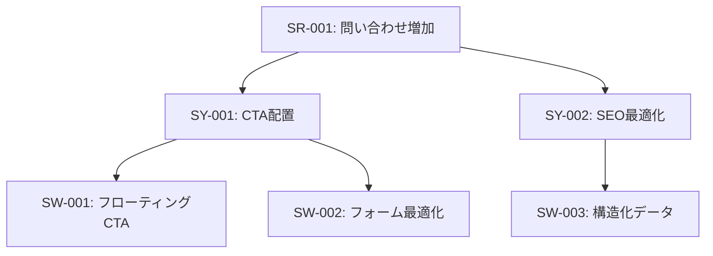

# ISO/IEC/IEEE 29148 詳細ガイド

要件の3階層構造とトレーサビリティの確保方法

---

## 概要

ISO/IEC/IEEE 29148は、要件工学（Requirements Engineering）の国際規格です。
要件を3つの階層に分けることで、「なぜ必要か」「どう実現するか」「具体的に何を作るか」を明確に分離します。

---

## 3階層の詳細

### 階層1: ステークホルダ要件（Stakeholder Requirements, SR）

#### 定義

**ステークホルダ（利害関係者）のニーズ、期待、制約を記述した要件**

- 「誰のため」の要件か
- 「なぜ」必要か
- 「どんな価値」があるか

#### 特徴

- ビジネス視点、ユーザー視点
- 技術的詳細を含まない
- 測定可能な目標を含む

#### 質問テンプレート

ステークホルダ要件を抽出するための質問:

1. **誰が？**
   - このプロジェクトに関わるステークホルダは誰ですか？
   - それぞれの役割は何ですか？

2. **何に困っている？**
   - 現在の課題は何ですか？
   - どんな不便を感じていますか？
   - 定量データはありますか？（例: 直帰率、問い合わせ数）

3. **なぜそれが重要？**
   - ビジネス価値は何ですか？
   - 解決したらどんな良いことがありますか？

4. **どれくらい重要？**
   - 優先度は？（高/中/低）
   - 必須ですか、それとも希望ですか？

#### 良い例

```markdown
| ID | ステークホルダ | ニーズ/課題 | ビジネス価値 | 優先度 |
|----|----------------|-------------|--------------|--------|
| SR-001 | 経営者 | 問い合わせ数を月10件→50件に増やしたい | 売上向上、認知度拡大 | 高 |
| SR-002 | カスタマーサポート | よくある質問の問い合わせを50%削減したい | 業務効率化、顧客満足度向上 | 中 |
| SR-003 | エンドユーザー | 製品情報を3クリック以内で見つけたい | 購入判断の迅速化 | 高 |
```

#### 悪い例（これはSRではない）

```markdown
❌ SR-001: フローティングCTAボタンを実装する
→ これはソフトウェア要件（SW）

❌ SR-002: Next.jsでSSRを使う
→ これは技術選定（SW）

✅ 正しくは:
SR-001: 経営者が問い合わせ数を増やしたい（なぜ必要か）
```

---

### 階層2: システム要件（System Requirements, SY）

#### 定義

**ステークホルダ要件を実現するためのシステムの機能・特性を記述した要件**

- 「どうやって」実現するか
- システムが「何を提供すべきか」
- 技術的詳細はまだ含まない

#### 特徴

- 解決策の方向性を示す
- 複数の実現方法がありうる
- ステークホルダ要件（SR）との関連を明記

#### 質問テンプレート

1. **どうやって解決する？**
   - このステークホルダ要件を実現する方法は？
   - どの機能/システムで解決しますか？

2. **何を提供する？**
   - ユーザーに何を提供しますか？
   - システムはどんな振る舞いをしますか？

3. **制約は？**
   - 技術的制約はありますか？
   - 予算、納期の制約は？

#### 良い例

```markdown
| ID | 関連SR | 要件 | 実現方法 | 優先度 |
|----|--------|------|----------|--------|
| SY-001 | SR-001 | CTAを全ページに配置する | フローティングボタン、フォーム最適化 | 高 |
| SY-002 | SR-002 | FAQセクションを追加する | 検索可能なFAQページ、カテゴリ分類 | 中 |
| SY-003 | SR-003 | サイト内検索機能を提供する | インクリメンタル検索、日本語対応 | 高 |
```

#### 悪い例

```markdown
❌ SY-001: React Hook Formを使ってフォームを実装
→ これはソフトウェア要件（SW）。技術選定は次の階層。

✅ 正しくは:
SY-001: フォームを最適化してCTAを実現する（どうやって解決するか）
```

---

### 階層3: ソフトウェア要件（Software Requirements, SW）

#### 定義

**システム要件を実現するための具体的なソフトウェアの仕様**

- 「具体的に何を作るか」
- 技術選定を含む
- テスト可能な受入条件を含む

#### 特徴

- 実装可能な粒度
- 受入条件が明確
- システム要件（SY）との関連を明記

#### 質問テンプレート

1. **具体的に何を作る？**
   - どんなコンポーネント/機能を実装しますか？
   - 技術スタックは何を使いますか？

2. **受入条件は？**
   - どうなったら完成ですか？
   - テスト方法は？

3. **非機能要件は？**
   - パフォーマンス目標は？
   - アクセシビリティ要件は？

#### 良い例

```markdown
| ID | 関連SY | 具体的な仕様 | 受入条件 | 技術選定 |
|----|--------|--------------|----------|----------|
| SW-001 | SY-001 | フローティングCTAボタン | ・3秒以内に表示<br>・スクロール追従<br>・全デバイス対応 | CSS position:sticky |
| SW-002 | SY-002 | FAQ検索機能 | ・インクリメンタル検索<br>・日本語対応<br>・1秒以内に結果表示 | Fuse.js |
| SW-003 | SY-003 | サイト内検索 | ・Algolia統合<br>・検索結果10件/ページ<br>・ハイライト表示 | Algolia Search API |
```

#### 受入条件の書き方

**SMART原則:**

- **S**pecific（具体的）
- **M**easurable（測定可能）
- **A**chievable（達成可能）
- **R**elevant（関連性がある）
- **T**ime-bound（期限がある）

**例:**

```markdown
❌ 悪い受入条件:
"速く表示される"

✅ 良い受入条件:
"Lighthouse測定でLCP 2.5秒以内"
```

---

## トレーサビリティの確保

### トレーサビリティとは

**要件間の関連を追跡可能にすること**

- 変更の影響範囲を特定できる
- 要件の根拠を説明できる
- 抜け漏れを防ぐ

### ID体系

```
SR-001, SR-002, SR-003, ... (ステークホルダ要件)
SY-001, SY-002, SY-003, ... (システム要件)
SW-001, SW-002, SW-003, ... (ソフトウェア要件)
```

### 関連の記述方法

#### 表形式

```markdown
## システム要件（SY）

| ID | 関連SR | 要件 |
|----|--------|------|
| SY-001 | SR-001 | CTAを全ページに配置 |
| SY-002 | SR-001, SR-002 | コンテンツSEO最適化 |
```

#### Mermaid図



### トレーサビリティマトリクス

全ての関連を一覧表示:

```markdown
| ステークホルダ要件 | システム要件 | ソフトウェア要件 |
|---------------------|--------------|------------------|
| SR-001: 問い合わせ増加 | SY-001: CTA配置 | SW-001: フローティングCTA |
|                     |              | SW-002: フォーム最適化 |
|                     | SY-002: SEO最適化 | SW-003: 構造化データ |
|                     |              | SW-004: メタタグ |
| SR-002: FAQ削減 | SY-003: FAQページ | SW-005: FAQ検索 |
```

---

## 実践例: コーポレートサイトリニューアル

### ステップ1: ヒアリング結果

```
【ヒアリング内容】
- 経営者: 問い合わせが少ない（月10件）。月50件にしたい。
- ユーザー調査: 製品情報が見つけにくい。スマホで見づらい。
- 現状: 直帰率80%、モバイル非対応。
```

### ステップ2: ステークホルダ要件（SR）を抽出

**質問:**
- 誰が？ → 経営者、エンドユーザー
- 何に困っている？ → 問い合わせ少ない、情報が見つからない
- なぜ重要？ → 売上向上、UX改善

**出力:**

```markdown
| ID | ステークホルダ | ニーズ/課題 | 現状 | 目標 | 優先度 |
|----|----------------|-------------|------|------|--------|
| SR-001 | 経営者 | 問い合わせ数を増やしたい | 月10件 | 月50件 | 高 |
| SR-002 | エンドユーザー | 製品情報を素早く見つけたい | 直帰率80% | 直帰率50%以下 | 高 |
| SR-003 | エンドユーザー | スマホで快適に閲覧したい | モバイル非対応 | 全デバイス対応 | 高 |
```

### ステップ3: システム要件（SY）に変換

**質問:**
- SR-001をどうやって実現する？ → CTAを配置、SEO最適化
- SR-002をどうやって実現する？ → サイト内検索、情報設計改善
- SR-003をどうやって実現する？ → レスポンシブデザイン

**出力:**

```markdown
| ID | 関連SR | 要件 | 実現方法 | 優先度 |
|----|--------|------|----------|--------|
| SY-001 | SR-001 | CTAを全ページに配置 | フローティングCTA、フォーム最適化 | 高 |
| SY-002 | SR-001, SR-002 | コンテンツSEO最適化 | メタタグ、構造化データ | 高 |
| SY-003 | SR-002 | サイト内検索機能 | インクリメンタル検索 | 中 |
| SY-004 | SR-003 | レスポンシブデザイン | モバイルファースト設計 | 高 |
```

### ステップ4: ソフトウェア要件（SW）に具体化

**質問:**
- SY-001を具体的にどう実装する？ → CSS sticky、React Hook Form
- SY-002を具体的にどう実装する？ → Next.js Metadata API
- SY-003を具体的にどう実装する？ → Algolia / Fuse.js
- SY-004を具体的にどう実装する？ → Tailwind CSS、375px〜1920px

**出力:**

```markdown
| ID | 関連SY | 具体的な仕様 | 受入条件 | 技術選定 |
|----|--------|--------------|----------|----------|
| SW-001 | SY-001 | フローティングCTAボタン | ・3秒以内に表示<br>・スクロール追従<br>・全デバイス対応 | CSS position:sticky |
| SW-002 | SY-001 | 問い合わせフォーム | ・入力項目5つ以内<br>・リアルタイムバリデーション | React Hook Form |
| SW-003 | SY-002 | JSON-LD構造化データ | ・Google Rich Results Test合格 | Next.js Metadata |
| SW-004 | SY-003 | サイト内検索 | ・1秒以内に結果表示<br>・日本語対応 | Fuse.js |
| SW-005 | SY-004 | レスポンシブ対応 | ・375px〜1920px対応<br>・画像最適化 | Tailwind CSS |
```

### ステップ5: トレーサビリティマトリクス

```markdown
| SR | SY | SW |
|----|----|----|
| SR-001: 問い合わせ増加 | SY-001: CTA配置 | SW-001: フローティングCTA |
|                         |                 | SW-002: フォーム最適化 |
|                         | SY-002: SEO最適化 | SW-003: 構造化データ |
| SR-002: 情報発見 | SY-002: SEO最適化 | SW-003: 構造化データ |
|                  | SY-003: サイト内検索 | SW-004: 検索機能 |
| SR-003: スマホ対応 | SY-004: レスポンシブ | SW-005: レスポンシブ実装 |
```

---

## 変更管理

### 変更時のフロー

```
1. 変更要求が来る
   ↓
2. どの階層の要件か特定（SR/SY/SW）
   ↓
3. トレーサビリティマトリクスで影響範囲を確認
   ↓
4. 関連する全ての要件を更新
   ↓
5. 変更履歴を記録
```

### 変更例

**シナリオ: クライアントから「CTAは不要」と言われた**

#### Step 1: どの要件か特定

```
「CTA不要」→ SR-001に関連
```

#### Step 2: 影響範囲を確認

```
トレーサビリティマトリクス:
SR-001 → SY-001 → SW-001, SW-002
```

#### Step 3: 関連要件を全て更新

```markdown
## 変更履歴

| 日付 | 変更内容 | 影響範囲 | 理由 |
|------|----------|----------|------|
| 2026-02-01 | SR-001を削除 | SY-001、SW-001、SW-002も削除 | クライアント要求 |
```

---

## よくある質問

### Q1: ステークホルダ要件とシステム要件の境界が曖昧です

A: 以下の質問で判別してください:

```
「技術的な解決策を含んでいますか？」
YES → システム要件
NO  → ステークホルダ要件
```

**例:**

```
"問い合わせを増やしたい" → SR（技術的解決策なし）
"CTAを配置する" → SY（解決策を含む）
"フローティングCTAボタンを実装" → SW（具体的な技術選定）
```

### Q2: 1つのステークホルダ要件から複数のシステム要件が生まれてもいいですか？

A: はい、むしろそれが正常です。

**例:**

```
SR-001: 問い合わせ増加
  ↓
SY-001: CTA配置
SY-002: SEO最適化
SY-003: フォーム改善
```

### Q3: システム要件を飛ばしてSRから直接SWを定義してもいいですか？

A: いいえ、必ず3階層を経由してください。

**理由:**
- 階層を飛ばすと、「なぜこの実装が必要か」が不明確になる
- 変更時の影響範囲が追跡できなくなる

### Q4: 非機能要件（性能、セキュリティ等）はどの階層に書きますか？

A: **ソフトウェア要件（SW）に書きます。**

ただし、ISO 25010の品質特性として別途整理することを推奨します。

**例:**

```markdown
## ソフトウェア要件（SW）
SW-001: フローティングCTA実装
  受入条件: 3秒以内に表示

## 品質要件（ISO 25010）
性能効率性: LCP 2.5秒以内
```

---

## チェックリスト

要件定義完了前に確認:

### ステークホルダ要件（SR）

- [ ] 全てのステークホルダを網羅しているか
- [ ] 各要件に「なぜ必要か」が明記されているか
- [ ] 優先度が付けられているか
- [ ] 測定可能な目標があるか

### システム要件（SY）

- [ ] 全てのSRに対応するSYが存在するか
- [ ] 技術的詳細を含みすぎていないか
- [ ] 関連SRが明記されているか
- [ ] 実現方法が複数ある場合、選択肢を検討したか

### ソフトウェア要件（SW）

- [ ] 全てのSYに対応するSWが存在するか
- [ ] 受入条件が明確か
- [ ] テスト可能か
- [ ] 技術選定が適切か

### トレーサビリティ

- [ ] 全ての要件にIDが付与されているか
- [ ] 階層間の関連が明記されているか
- [ ] トレーサビリティマトリクスが作成されているか

---

## 参考資料

- ISO/IEC/IEEE 29148:2018 - Systems and software engineering — Life cycle processes — Requirements engineering
- [要件定義に不安があった実務3年目エンジニア、国際規格に救われる](https://qiita.com/howanpin5525/items/dda01037624623a8e7ca)
