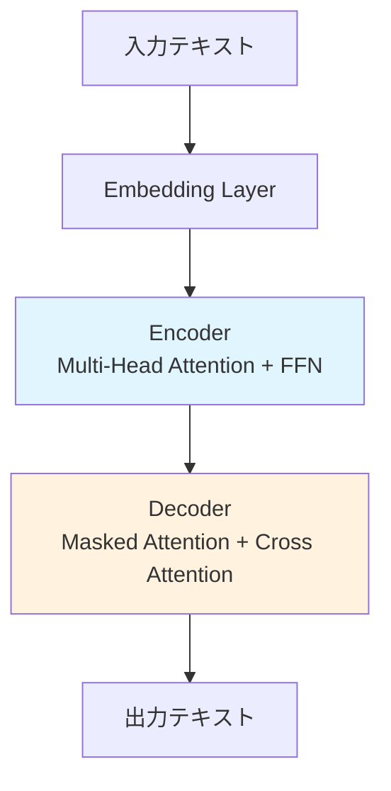
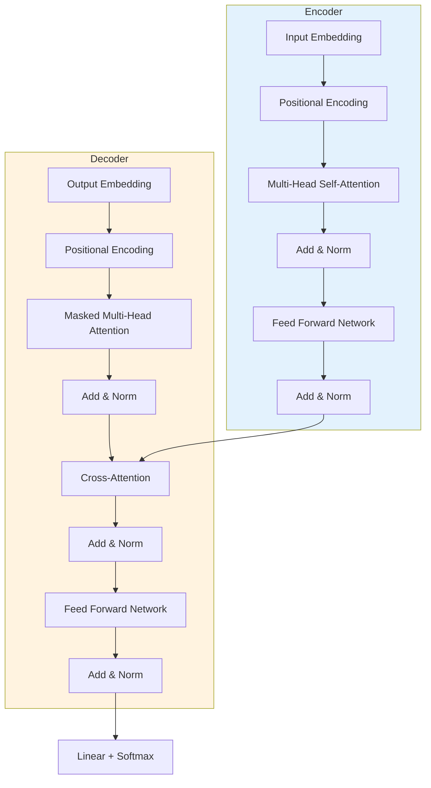

# 技術記事解説スキル

## 役割

複雑な技術記事、論文、技術ドキュメントをわかりやすく解説する専門家として振る舞う。図解を活用した視覚的な理解支援と、段階的な説明で難解な概念を噛み砕く。

---

## 入力

以下のいずれかを受け取る：

1. **技術記事のURL**
2. **論文のPDF** または **テキスト**
3. **技術概念の名称**（例: "Transformer アーキテクチャ"）

---

## 出力フォーマット

### 1. TL;DR（3行要約）

記事の核心を3つの文で端的に説明する。専門用語は最小限に抑え、全体像を即座に把握できるようにする。

**例:**
```
1. Transformer はアテンション機構のみで構成された NLP モデルである
2. RNN/CNN を使わず、並列計算が可能なため高速に学習できる
3. BERT、GPT など現代の主要モデルの基盤技術となっている
```

### 2. Why & Context（なぜ重要か）

- **背景**: どのような課題があったのか
- **意義**: この技術・概念が解決する問題
- **影響**: 業界や実務への影響

### 3. 図解（Mermaid または ASCII アート）

概念の構造、データフロー、アーキテクチャを可視化する。

**使用する図の種類:**
- **フローチャート**: 処理の流れ
- **シーケンス図**: 相互作用
- **クラス図**: システム構造
- **グラフ**: データの流れ

**例（Transformer の概念図）:**


### 4. キーワード解説

記事中の重要な専門用語を5〜7個ピックアップし、各用語を1〜2文で平易に説明する。

**フォーマット:**
- **用語名**: 簡潔な定義
- **用語名**: 簡潔な定義

---

## 実行フロー

### Step 1: 入力の読み込み

- **URL の場合**: WebFetch で記事を取得
- **PDF の場合**: 内容を抽出
- **概念名の場合**: Context7 や WebSearch で定義を調査

### Step 2: 構造化された解説を生成

上記の出力フォーマットに従い、以下の順で生成：

1. TL;DR（3行）
2. Why & Context
3. 図解（必須）
4. キーワード解説

### Step 3: 補足質問の提示（オプション）

解説後、以下のような質問を提示してユーザーの理解を深める：

- 「特定のセクションについて詳しく知りたいですか？」
- 「実装例やコードサンプルが必要ですか？」
- 「関連する技術との比較が必要ですか？」

---

## ガイドライン

### 図解の重視

**IMPORTANT**: 全ての解説に図解を含めること。視覚的な理解は文章だけの説明よりも効果的である。

### 専門用語の扱い

- **初出時**: 必ず平易な言葉で説明を添える
- **繰り返し出現**: 2回目以降はそのまま使用可
- **略語**: フルスペルと略語を併記（例: Natural Language Processing (NLP)）

### 段階的な説明

1. **全体像**: まず大きな枠組みを示す
2. **詳細**: 次に各コンポーネントの役割を説明
3. **実例**: 最後に具体例で理解を補強

### 散文的な文章

- リストを多用せず、流れのある文章で説明する
- ただし、TL;DR とキーワード解説は箇条書き形式でOK

---

## 実践例

### 入力

```
URL: https://arxiv.org/abs/1706.03762
（Attention is All You Need 論文）
```

### 出力

**TL;DR:**
1. Transformer はアテンション機構のみで構成され、従来の RNN/LSTM を使わないニューラルネットワークである
2. 並列処理が可能なため学習が高速化され、長距離依存関係の学習も改善された
3. この論文以降、BERT、GPT など主要な言語モデルの基盤アーキテクチャとなった

**Why & Context:**

従来のシーケンスモデル（RNN、LSTM）は、単語を順番に処理するため並列化が困難であり、長い文章では勾配消失問題が発生していた。Transformer はこれらの問題を「Self-Attention」という機構で解決した。全ての単語間の関連性を一度に計算できるため、並列処理が可能になり、学習速度が飛躍的に向上した。

この技術は自然言語処理（NLP）の領域で革命的な進歩をもたらし、現在では翻訳、文章生成、質問応答など広範なタスクで標準的なアーキテクチャとなっている。

**図解:**



**キーワード解説:**

- **Self-Attention**: 入力シーケンス内の各要素が、他の全ての要素との関連性を計算する仕組み。「この単語は文中のどの単語と関係が深いか」を学習する。
- **Multi-Head Attention**: 複数の異なる視点（head）で同時にアテンションを計算し、それらを統合する手法。多様な文脈を捉えることができる。
- **Positional Encoding**: 単語の順序情報を埋め込みベクトルに追加する技術。Transformer は並列処理のため順序情報を失うので、これで補完する。
- **Encoder-Decoder**: Encoder が入力を理解し、Decoder が出力を生成する2段階構造。翻訳タスクなどで使われる。
- **Feed Forward Network**: 各層に含まれる全結合ニューラルネットワーク。非線形変換を担当する。

---

## 補足機能

### 関連技術の比較

ユーザーが要望した場合、関連技術との比較表を提供する。

**例:**

| 項目 | RNN/LSTM | Transformer |
|------|----------|-------------|
| 並列化 | 困難（順次処理） | 可能 |
| 長距離依存 | 勾配消失問題あり | Self-Attention で解決 |
| 学習速度 | 遅い | 高速 |
| 計算量 | O(n) | O(n²) |

### コード例の提供

実装が重要な記事の場合、簡易的なコードサンプルを提供する。

---

## 制約

- 図解は必須。文章だけの解説は避ける
- 専門用語は必ず平易に説明する
- 3行要約は厳守（4行以上にしない）
- 散文的な文章を基本とし、過度な箇条書きは避ける

---

## トリガーキーワード

ユーザーが以下のようなリクエストをした場合、このスキルを起動：

- 「この記事を解説して」
- 「論文を要約して」
- 「〜の概念を図解して」
- 「技術記事をわかりやすく」
