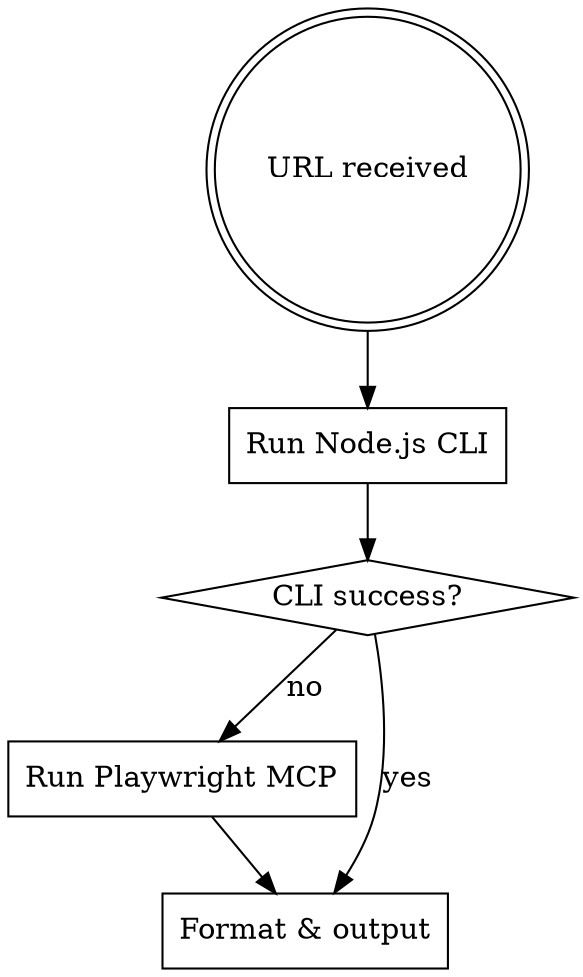

# X投稿取得スキル

X投稿URLからデータを抽出する。Node.js CLI（Playwright headless）を優先し、失敗時のみPlaywright MCPにフォールバック。

## 実行フロー



## 抽出ロジック（共通）

以下の `page.evaluate` は CLI・MCP 両方で同一コードを使う。

```javascript
const data = await page.evaluate(() => {
  const a = document.querySelector('article');
  if (!a) return { error: 'article not found' };
  const userLines = a.querySelector('[data-testid="User-Name"]')?.innerText.split('\n') ?? [];
  return {
    userName: userLines[0] || '',
    userHandle: userLines.find(s => s.startsWith('@')) || '',
    text: a.querySelector('[data-testid="tweetText"]')?.innerText || '',
    timestamp: a.querySelector('time')?.getAttribute('datetime') || '',
    displayTime: a.querySelector('time')?.innerText || '',
    engagement: {
      replies: a.querySelector('[data-testid="reply"]')?.getAttribute('aria-label') || '',
      retweets: a.querySelector('[data-testid="retweet"]')?.getAttribute('aria-label') || '',
      likes: a.querySelector('[data-testid="like"]')?.getAttribute('aria-label') || '',
    },
    media: {
      type: a.querySelector('[data-testid="videoPlayer"]') ? 'video'
          : a.querySelector('[data-testid="tweetPhoto"]') ? 'image' : 'none',
    }
  };
});
```

画像付き（`media.type === 'image'`）の場合、抽出後にスクリーンショットも取得:
```javascript
await page.locator('article').first().screenshot({ path: '/tmp/x_post_image.png' });
```

## Step 1: Node.js CLI方式（優先）

heredocで実行する（`node -e` は `!` のbash history expansion問題で失敗するため）。

```bash
node - <<'NODEEOF'
const { execFileSync } = require('child_process');
const fs = require('fs');
const path = require('path');

// which playwright → realpath → package.json探索でモジュールルートを動的解決
// mise等のバージョンマネージャ経由でも正しく動作する
function findPlaywright() {
  try { return require('playwright'); } catch {}
  const bin = execFileSync('which', ['playwright']).toString().trim();
  let dir = path.dirname(fs.realpathSync(bin));
  while (dir !== '/') {
    try {
      if (JSON.parse(fs.readFileSync(path.join(dir, 'package.json'), 'utf8')).name === 'playwright') {
        return require(dir);
      }
    } catch {}
    dir = path.dirname(dir);
  }
  throw new Error('playwright module not found');
}

const { chromium } = findPlaywright();
const UA = 'Mozilla/5.0 (Macintosh; Intel Mac OS X 10_15_7) AppleWebKit/537.36 (KHTML, like Gecko) Chrome/137.0.0.0 Safari/537.36';
(async () => {
  const browser = await chromium.launch({ headless: true });
  const page = await browser.newPage({ userAgent: UA });
  try {
    await page.goto('TARGET_URL', { waitUntil: 'domcontentloaded', timeout: 30000 });
    await page.waitForSelector('[data-testid="tweetText"]', { timeout: 5000 }).catch(() => null);
    // ← ここに抽出ロジック（共通）を埋め込む
    if (data.media?.type === 'image') {
      await page.locator('article').first().screenshot({ path: '/tmp/x_post_image.png' });
    }
    console.log(JSON.stringify(data, null, 2));
  } finally { await browser.close(); }
})();
NODEEOF
```

## Step 2: Playwright MCP方式（フォールバック）

Step 1 が失敗した場合（`MODULE_NOT_FOUND`、終了コード非0、空出力、JSONに `error` キー）のみ使用。

```
1. mcp__playwright__browser_navigate → TARGET_URL
2. mcp__playwright__browser_run_code → 抽出ロジック（共通）を実行
3. mcp__playwright__browser_close → セッション閉じる（必須）
```

## Step 3: 結果の整形と出力

画像あり → Read で `/tmp/x_post_image.png` を表示。動画 → メタデータのみ。

```
**投稿者:** {userName} ({userHandle})
**日時:** {displayTime}
**本文:**
{text}

**エンゲージメント:** 返信{replies} / リポスト{retweets} / いいね{likes}
**メディア:** {type}
```

## エラーハンドリング

| エラー | 対応 |
|--------|------|
| `article not found` | URL確認 or 再試行 |
| `Cannot find package 'playwright'` / `which` 失敗 | Step 2 にフォールバック |
| タイムアウト | timeout値を増やして再試行 |

## 制限事項

- 公開投稿のみ（ログイン要求の投稿は取得不可）
- 動画はメタデータのみ
- リプライチェーンはメイン投稿のみ
