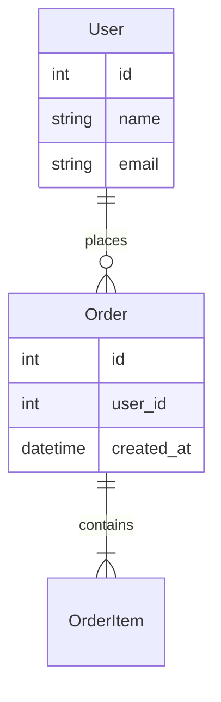
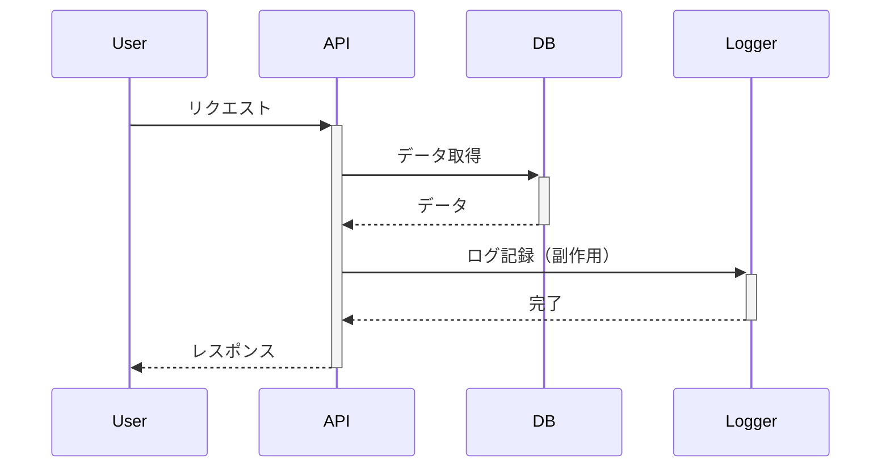

# ソフトウェア考古学 - レガシーシステムの理解と保守

> 出典: https://speakerdeck.com/oguri/xin-zu-kara4nian-jian-20nian-mononowebsabisuto-xiang-kihe-tutexue-ndasohutoueakao-gu-xue
> 発表日: 2025年3月23日（PHPerKaigi 2025）
> 発表者: 小栗大輝（株式会社CARTA HOLDINGS）
> 追加日: 2026-01-31

## 概要

ソフトウェア考古学（Software Archaeology）とは、**正確なドキュメントまたは知識者へのアクセスがない場合、レガシーシステムのソースコード分析により、当時の設計思想や変化過程を理解するプロセス**です。（Agile Modeling より）

20年以上稼働するレガシーシステムの保守・改善において、どのようにシステムを理解し、効率的に変更を加えるかを解説します。

---

## 1. 理解の難しさの根本原因

### メンタルモデルとの乖離

**メンタルモデル**: 開発者が過去の経験に基づいて持つ、システムの動作に対する期待

**問題**:
- 自身の持つメンタルモデルとレガシーシステムの実装が大きく乖離
- 期待と実装の差異が多い
- 「なぜこうなっているのか」が理解できない

**例**:

```php
// 期待: get○○ は副作用のない取得関数
function getUserData($userId) {
  $user = fetchUserFromDB($userId);

  // 期待外: 副作用のある登録処理が内部で動作
  registerAccessLog($userId);
  updateLastAccessTime($userId);

  return $user;
}
```

**対策**: 古いコードに適応させたメンタルモデルを新たに構築する

---

## 2. 理解のアプローチ（鳥の目と虫の目）

### 鳥の目（俯瞰的把握）

**目的**: システム全体の構造と変化の傾向を理解

**手法**:
- 依存関係の可視化
- 全体構造の把握
- データの流れの追跡
- システムの変化傾向の分析

**ツール**:
- 依存関係図（dependency graph）
- ER図
- シーケンス図
- Git ログ分析

---

### 虫の目（詳細把握）

**目的**: 具体的な実装の詳細を理解

**手法**:
- プリントデバッグ（`var_dump`、`console.log`）
- デバッグツール（PsySH、Xdebug、Chrome DevTools）
- リファクタリング試行（動作確認しながら理解）

**ツール**:
- デバッガー
- ログ出力
- テストコード

---

### 行き来による理解深化

```
鳥の目で全体把握
  ↓
虫の目で詳細確認
  ↓
鳥の目で再び全体を見直し
  ↓
虫の目で新たな詳細を確認
  ↓
繰り返し...
```

**効果**: 設計思想や変化の過程を読み取れる

---

## 3. アウトプット重視の理解

### メンタルモデルの外部化

**問題**: 脳内に留めると認知リソースを消費

**解決策**: ドキュメント、図表として外部化

**外部化の形式**:
- ER図
- シーケンス図
- フローチャート
- アーキテクチャ図
- README / Wiki

**効果**:
- 認知リソースを解放
- より複雑な構造把握に充当
- チームでの知識共有

---

### 外部化の例

**ER図の作成**:



**シーケンス図の作成**:



---

## 4. 枝切りの判断

### 無限の深堀りを避ける

**問題**: 全てを理解しようとすると時間がかかりすぎる

**対策**: 意思決定に必要な情報が揃った時点で詳細追跡を終了

**判断基準**:
- この変更に影響するか？
- この部分を理解しないと進められないか？
- 今の理解で十分か？

---

### 目的に応じた粒度の知識習得

| 目的 | 必要な理解レベル |
|------|----------------|
| 軽微な修正 | 該当箇所のみ詳細に |
| 機能追加 | 関連モジュール全体を俯瞰 |
| 大規模リファクタリング | システム全体の構造と依存関係 |

---

## 5. コード深掘りのスピード選択

### 3つのレベル

| レベル | 手法 | 速度 | 詳細度 |
|--------|------|------|--------|
| 1 | 脳内インタプリタ | 速い | 低い |
| 2 | var_dump / console.log | 中程度 | 中程度 |
| 3 | デバッグツール | 遅い | 高い |

---

### レベル1: 脳内インタプリタ

**手法**: コードを読んで動作を想像

**適用場面**:
- メンタルモデルとのズレが小さい
- 単純なロジック
- 時間が限られている

**例**:

```javascript
function add(a, b) {
  return a + b;
}
// 脳内で理解可能
```

---

### レベル2: var_dump / console.log

**手法**: 変数の中身を出力して確認

**適用場面**:
- メンタルモデルとのズレが中程度
- 変数の値を確認したい
- データの流れを追いたい

**例**:

```php
function processUser($userId) {
  $user = getUserData($userId);
  var_dump($user); // 中身を確認
  // 期待: ['id' => 1, 'name' => 'Alice']
  // 実際: ['id' => 1, 'name' => 'Alice', 'access_log' => [...]]
}
```

---

### レベル3: デバッグツール

**手法**: ブレークポイント、ステップ実行

**適用場面**:
- メンタルモデルとのズレが大きい
- 複雑なロジック
- バグの原因特定

**ツール**:
- Xdebug（PHP）
- Chrome DevTools（JavaScript）
- pdb（Python）
- gdb（C/C++）

---

## 6. ユースケース

### 広告管理画面の改修

**背景**: 複数存在する類似画面の差分特定

**アプローチ**:
1. 鳥の目: 全画面の構造を比較
2. 虫の目: 差分箇所を詳細確認
3. ドキュメント化: 差分一覧を作成

**成果**: 効率的な改修計画

---

### バッチ処理の移行

**背景**: Perl の旧基盤を PHP の現行基盤へ移行

**課題**:
- 言語の違い
- 設計思想の切り替え

**アプローチ**:
1. Perl コードの理解（鳥の目）
2. 処理フローの図式化（外部化）
3. PHP での再実装（虫の目）

**成果**: スムーズな移行

---

## 7. ベストプラクティス

### 1. 意思決定記録の保持

**重要**: 最新ドキュメントより「なぜそうしたか」の記録が有効

**記録内容**:
- なぜこの実装を選んだか
- 他の選択肢は何があったか
- 何を考慮して決定したか

**形式**:
- ADR（Architecture Decision Records）
- コミットメッセージ
- Pull Request のコメント

**例（ADR）**:

```markdown
# ADR-001: データベース選定

## 決定
PostgreSQL を採用

## 理由
- トランザクション対応が必要
- JSON 型のサポート
- 運用実績が豊富

## 他の選択肢
- MySQL: JSON サポートが弱い
- MongoDB: トランザクション対応が不十分
```

---

### 2. 柔軟な設計

**手法**: 変更頻度の高い領域を予測し、初期設計に反映

**具体例**:
- ビジネスロジックを独立させる
- 設定ファイルで変更可能にする
- プラグイン機構の導入

---

### 3. 予防的コメント

**目的**: メンタルモデルズレが予想される箇所に補足

**例**:

```php
// 注意: getUserData() は副作用があり、アクセスログを記録します
$user = getUserData($userId);
```

**効果**: 将来の開発者が誤解しない

---

### 4. 改善の正当化

**問題**: 規模の大きなシステムでは、モチベーション維持が困難

**対策**: 改善の意義を反復確認

**確認内容**:
- この改善で何が良くなるか
- 誰が恩恵を受けるか
- どのくらいの効果があるか

---

## 8. レガシーシステム保守のチェックリスト

実装前に確認:

- [ ] メンタルモデルを意識しているか
- [ ] 鳥の目と虫の目を使い分けているか
- [ ] 理解をドキュメント化しているか
- [ ] 枝切りの判断を適切に行っているか
- [ ] 意思決定を記録しているか
- [ ] 予防的コメントを残しているか
- [ ] 改善の意義を確認しているか

---

## 9. フロントエンド開発への応用

### レガシー JavaScript の理解

**課題**:
- jQuery 時代のコード
- グローバル変数の多用
- イベントハンドラーの複雑な依存関係

**アプローチ**:
1. 鳥の目: 全体の構造を把握（どのファイルが何をしているか）
2. 虫の目: イベントリスナーを追跡
3. ドキュメント化: イベントフロー図を作成

---

### レガシー CSS の理解

**課題**:
- 詳細度の競合
- 未使用スタイルの残存
- 命名規則の不統一

**アプローチ**:
1. 鳥の目: CSS の依存関係を可視化
2. 虫の目: 特定要素のスタイル適用を追跡
3. ドキュメント化: スタイルガイドを作成

**ツール**:
- Chrome DevTools（Computed スタイル確認）
- CSS Stats（統計情報）
- UnCSS（未使用CSS検出）

---

## 参考資料

- [Agile Modeling: Software Archaeology](http://agilemodeling.com/essays/softwareArchaeology.htm)
- [Working Effectively with Legacy Code](https://www.amazon.com/dp/0131177052) - Michael Feathers
- [Refactoring: Improving the Design of Existing Code](https://www.amazon.com/dp/0134757599) - Martin Fowler

---

## 関連ナレッジ

- [リファクタリング手法](./refactoring-techniques.md)
- [デバッグテクニック](./debugging-techniques.md)
- [ドキュメント作成](./documentation-best-practices.md)
- [コードレビュー](./code-review.md)
