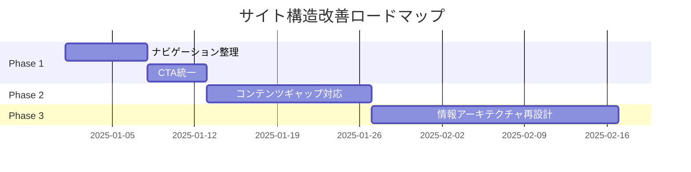

# サイト構造レビュー・改善提案

## 概要

analyze-websiteスキルの出力（サイトマップ + ワイヤーフレーム + コンテンツ分析）を入力として、サイト全体を俯瞰し、構造上の問題点・不足・改善案を作成する。

## 前提条件

このスキルを実行する前に、以下が必要：

1. **analyze-website スキル**で対象サイトを分析済み
2. 出力ディレクトリに以下のファイルが存在：
   - `sitemap.md`（サイトマップ）
   - `wireframes/*.md`（各ページのワイヤーフレーム）
   - （任意）コンテンツ分析付きワイヤーフレーム

## 入力情報の確認

スキル実行時、以下を確認する：

### 1. 入力ファイルのパス

- wireframe-output ディレクトリのパス
- または個別ファイルのパス

### 2. サイトの目的（ユーザーに確認）

- **コーポレートサイト**: 企業情報・信頼性訴求
- **サービスサイト**: サービス紹介・コンバージョン
- **ECサイト**: 商品販売・購入導線
- **メディアサイト**: 情報提供・回遊性
- **ランディングページ**: 単一コンバージョン
- **採用サイト**: 採用応募・企業文化訴求

### 3. 主要KPI（ユーザーに確認）

- 問い合わせ数
- 資料請求数
- 購入数
- 会員登録数
- ページ閲覧数
- 滞在時間

### 4. レビュー観点の選択（複数選択可）

- **情報アーキテクチャ**: サイト構造・階層・分類
- **ユーザーフロー**: 導線・コンバージョンパス
- **コンテンツギャップ**: 不足ページ・情報
- **一貫性**: デザイン・UXパターン
- **SEO構造**: URL設計・内部リンク
- **アクセシビリティ**: 構造的なa11y課題
- **すべて**: 包括的レビュー

## 実行フロー

### Step 1: 入力ファイルの読み込み

```text
Read tool で以下を読み込み：
- sitemap.md
- wireframes/*.md（全ページ）
```

サイト全体像を把握：

- 総ページ数
- 階層構造
- 主要セクション
- ナビゲーション構造

### Step 2: 情報アーキテクチャ分析

#### 2.1 階層構造の評価

```markdown
## 階層構造分析

### 現状
- 最大階層深度: [N]階層
- 平均階層深度: [N]階層
- トップからの平均クリック数: [N]回

### 問題点
- [ ] 深すぎる階層（4階層以上）
- [ ] 浅すぎる階層（1ページに情報過多）
- [ ] 不均衡な階層（セクションによる差）

### 改善提案
- [具体的な改善案]
```

#### 2.2 分類・グルーピング評価

```markdown
## 分類・グルーピング分析

### 現状のカテゴリ構造
[Mermaidまたはリストで表現]

### 問題点
- [ ] 重複するカテゴリ
- [ ] 曖昧な分類名
- [ ] ユーザーメンタルモデルとの乖離
- [ ] 非対称なグルーピング

### 改善提案
- [具体的な改善案]
```

### Step 3: ユーザーフロー分析

#### 3.1 主要導線の特定

```markdown
## ユーザーフロー分析

### 主要コンバージョンパス
1. トップ → [ページA] → [ページB] → [コンバージョン]
2. ...

### 各パスの評価
| パス | ステップ数 | 離脱リスク | ボトルネック |
|------|-----------|-----------|-------------|
| パス1 | 3 | 中 | ページBのCTA不明瞭 |

### 問題点
- [ ] コンバージョンまでのステップが多い
- [ ] 中間ページにCTAがない
- [ ] 戻り導線がない
- [ ] 複数の競合するCTA
```

#### 3.2 ナビゲーション評価

```markdown
## ナビゲーション分析

### グローバルナビ
- 項目数: [N]
- 一貫性: [評価]
- 優先順位: [評価]

### ローカルナビ
- パンくずリスト: [有/無]
- サイドナビ: [有/無]
- 関連リンク: [有/無]

### 問題点
- [ ] ナビ項目が多すぎる（7±2ルール違反）
- [ ] 重要ページがナビにない
- [ ] ドロップダウンが深すぎる
- [ ] モバイルでの操作性

### 改善提案
- [具体的な改善案]
```

### Step 4: コンテンツギャップ分析

#### 4.1 不足ページの検出

```markdown
## コンテンツギャップ分析

### サイト目的に対して不足しているページ

| 推奨ページ | 重要度 | 理由 |
|-----------|--------|------|
| FAQ | 高 | 問い合わせ削減・SEO |
| 導入事例 | 高 | 信頼性・意思決定支援 |
| 料金ページ | 中 | 検討段階のユーザー向け |

### 競合との比較で不足している情報
- [競合分析に基づく提案]

### カスタマージャーニー上の不足
| ステージ | 現状 | 不足 |
|----------|------|------|
| 認知 | ... | ... |
| 興味 | ... | ... |
| 検討 | ... | ... |
| 購入 | ... | ... |
| 継続 | ... | ... |
```

#### 4.2 情報の重複・冗長性

```markdown
## 重複・冗長性分析

### 重複コンテンツ
| ページA | ページB | 重複内容 | 推奨アクション |
|---------|---------|----------|---------------|
| /about | /company | 会社概要 | 統合 |

### 分散している情報
- [1つにまとめるべき情報]
```

### Step 5: 一貫性分析

```markdown
## 一貫性分析

### レイアウトパターン
| パターン | 使用ページ | 一貫性 |
|----------|-----------|--------|
| ヘッダー | 全ページ | ○ |
| CTA配置 | 不統一 | △ |
| カード | 3種類混在 | × |

### 問題点
- [ ] ページごとにレイアウトが異なる
- [ ] CTAのデザイン・文言が不統一
- [ ] フォームUIが統一されていない

### 改善提案
- [デザインシステム観点での提案]
```

### Step 6: SEO構造分析

```markdown
## SEO構造分析

### URL設計
- 一貫性: [評価]
- 日本語URL: [有/無]
- パラメータ: [評価]

### 内部リンク構造
- 孤立ページ: [リスト]
- リンク集中ページ: [リスト]
- 相互リンク不足: [リスト]

### 見出し構造（H1-H6）
| ページ | H1 | 問題点 |
|--------|-----|--------|
| /about | 複数H1 | H1は1つに |

### 改善提案
- [SEO観点での構造改善]
```

### Step 7: 改善提案の優先順位付け

```markdown
## 改善提案サマリー

### 優先度: 高（すぐに対応）
| # | 課題 | 改善案 | 影響範囲 | 工数 |
|---|------|--------|----------|------|
| 1 | ... | ... | 全ページ | 小 |
| 2 | ... | ... | ... | ... |

### 優先度: 中（次フェーズ）
| # | 課題 | 改善案 | 影響範囲 | 工数 |
|---|------|--------|----------|------|
| 1 | ... | ... | ... | ... |

### 優先度: 低（将来的に検討）
| # | 課題 | 改善案 | 影響範囲 | 工数 |
|---|------|--------|----------|------|
| 1 | ... | ... | ... | ... |

### 改善ロードマップ（提案）



```

### Step 8: 出力

```

site-review-output/
├── summary.md              # エグゼクティブサマリー
├── ia-analysis.md          # 情報アーキテクチャ分析
├── user-flow-analysis.md   # ユーザーフロー分析
├── content-gap-analysis.md # コンテンツギャップ分析
├── consistency-analysis.md # 一貫性分析
├── seo-analysis.md         # SEO構造分析
├── recommendations.md      # 改善提案（優先順位付き）
└── roadmap.md              # 改善ロードマップ

```

## 出力フォーマット

### エグゼクティブサマリー

```markdown
# サイト構造レビュー: [サイト名]

## 概要
- 分析日: YYYY-MM-DD
- 対象URL: https://example.com
- 総ページ数: N ページ
- サイト目的: [目的]

## 総合評価

| 観点 | 評価 | コメント |
|------|------|----------|
| 情報アーキテクチャ | ★★★☆☆ | 階層は適切だが分類に改善余地 |
| ユーザーフロー | ★★☆☆☆ | コンバージョン導線が弱い |
| コンテンツ充足度 | ★★★★☆ | FAQの追加を推奨 |
| 一貫性 | ★★★☆☆ | CTAの統一が必要 |
| SEO構造 | ★★★★☆ | 内部リンク強化を推奨 |

## 重要な発見

### 強み
1. [強み1]
2. [強み2]

### 課題
1. [課題1 - 影響度: 高]
2. [課題2 - 影響度: 中]

## 推奨アクション（Top 5）

1. **[アクション1]** - 工数: 小, 効果: 大
2. **[アクション2]** - 工数: 中, 効果: 大
3. ...
```

## 分析チェックリスト

### 情報アーキテクチャ

- [ ] 3クリックルール（重要ページへ3クリック以内）
- [ ] 7±2ルール（ナビ項目数）
- [ ] MECE（漏れなく、ダブりなく）
- [ ] ユーザーメンタルモデルとの整合性

### ユーザーフロー

- [ ] コンバージョンへの明確な導線
- [ ] 各ページにCTAが存在
- [ ] 戻り導線・回遊導線
- [ ] エラー・行き止まりの回避

### コンテンツ

- [ ] サイト目的に必要なページの網羅
- [ ] カスタマージャーニー各段階のカバー
- [ ] 信頼性要素（実績、第三者評価）
- [ ] よくある質問・不安の解消

### 一貫性

- [ ] ヘッダー・フッターの統一
- [ ] CTA のデザイン・配置・文言
- [ ] フォームUI
- [ ] カード・リストのパターン

### SEO

- [ ] URL設計の一貫性
- [ ] 内部リンクの適切な配置
- [ ] 見出し構造（H1-H6）
- [ ] パンくずリスト

## クイックスタート例

```
「wireframe-output-aux のワイヤーフレームをレビューして」

→ 以下を確認：
1. サイト目的: コーポレートサイト
2. 主要KPI: 問い合わせ数
3. レビュー観点: すべて

→ 出力:
- summary.md（総合評価 + Top 5 推奨アクション）
- 各分析レポート
- recommendations.md（優先順位付き改善提案）
```

## 連携ワークフロー

```
[analyze-website スキル]
        ↓
    サイトマップ
    ワイヤーフレーム
    コンテンツ分析
        ↓
[review-site-structure スキル] ← 現在のスキル
        ↓
    構造分析
    問題点特定
    改善提案
        ↓
[実装・リニューアル作業]
```
