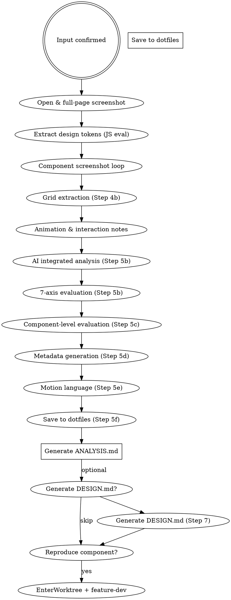

# Website Design Analysis Skill

Analyze a target website to extract design tokens (colors, typography, spacing) and capture component screenshots. Optionally reproduce a specific component in an isolated worktree.

## Iron Law

1. Analysis and reference only. Do not redistribute copyrighted assets.
2. Always confirm scope (analyze-only vs. reproduce) before starting.

## Execution Flow



## Step 1: Confirm Input

Ask the user for:
- URL of the target site
- Analysis goal: which aspects? (`colors` / `typography` / `layout` / `components` / `all`)
- Output directory (default: `/tmp/clone-{domain}/`)

Create the output directory before proceeding:
```bash
mkdir -p /tmp/clone-DOMAIN/components
```

## Step 2: Open & Full-Page Screenshot

```bash
agent-browser open TARGET_URL
agent-browser wait 'body'
agent-browser screenshot /tmp/clone-DOMAIN/full-page.png
```

- The `agent-browser` command is resolved via a mise shim. No need to hardcode the path.
- Pass `--session <unique-name>` when running in parallel subagents to avoid state mixing.

## Step 3: Extract Design Tokens via JS Eval

Run the following JS with `agent-browser eval`:

```javascript
(() => {
  const els = [...document.querySelectorAll('*')];
  const get = (el, prop) => getComputedStyle(el).getPropertyValue(prop).trim();

  // Colors: collect unique non-transparent backgrounds + text colors
  const colors = new Set();
  els.slice(0, 200).forEach(el => {
    ['background-color', 'color', 'border-color'].forEach(p => {
      const v = get(el, p);
      if (v && v !== 'rgba(0, 0, 0, 0)' && v !== 'transparent') colors.add(v);
    });
  });

  // Typography
  const fonts = new Set();
  const sizes = new Set();
  els.slice(0, 200).forEach(el => {
    fonts.add(get(el, 'font-family'));
    sizes.add(get(el, 'font-size'));
  });

  // Spacing
  const radii = new Set();
  els.slice(0, 200).forEach(el => {
    const r = get(el, 'border-radius');
    if (r && r !== '0px') radii.add(r);
  });

  return JSON.stringify({
    colors: [...colors].slice(0, 30),
    fontFamilies: [...fonts].filter(Boolean).slice(0, 10),
    fontSizes: [...sizes].filter(Boolean).slice(0, 15),
    borderRadii: [...radii].slice(0, 10),
    pageTitle: document.title,
    metaDescription: document.querySelector('meta[name="description"]')?.content || ''
  }, null, 2);
})()
```

### Fallback for Step 3

If `agent-browser eval` fails, use Chrome MCP: `mcp__chrome-devtools__evaluate_script`.

## Step 4: Component Screenshot Loop

Identify key sections and capture each one:

```bash
# Example: scroll to section and screenshot
agent-browser eval 'document.querySelector("nav").scrollIntoView()'
agent-browser screenshot /tmp/clone-DOMAIN/nav.png

agent-browser eval 'document.querySelector("footer").scrollIntoView()'
agent-browser screenshot /tmp/clone-DOMAIN/footer.png
```

Target sections (capture as many as exist): `nav`, `hero`, `cards`, `features`, `testimonials`, `footer`.
Save component screenshots under `/tmp/clone-DOMAIN/components/` when there are multiple variants.

## Step 4b: Grid Extraction

Run the JS from `references/grid-extraction.md` via `agent-browser eval`:

```bash
agent-browser eval '<JS from references/grid-extraction.md>'
```

Save result as `grid.json` in the output directory. This feeds Step 5b and `tokens.yaml`.

## Step 5: Animation & Interaction Notes

Run the following JS with `agent-browser eval` to record transition and animation patterns:

```javascript
(() => {
  const sheets = [...document.styleSheets];
  const transitions = [];
  const animations = [];
  try {
    sheets.forEach(s => {
      [...(s.cssRules || [])].forEach(r => {
        if (r.style?.transition) transitions.push(r.selectorText + ': ' + r.style.transition);
        if (r.style?.animation) animations.push(r.selectorText + ': ' + r.style.animation);
      });
    });
  } catch (e) {}
  return JSON.stringify({
    transitions: transitions.slice(0, 10),
    animations: animations.slice(0, 10)
  }, null, 2);
})()
```

Save result as `{output_dir}/motion-raw.json`. This feeds Step 5e.

## Step 5b: AI Integrated Analysis

Follow `references/ai-analysis-prompt.md` exactly. Pass:
- Full-page screenshot (image)
- 2–3 component screenshots (nav, hero, main section)
- Token JSON from Step 3
- Grid JSON from Step 4b
- Animation data from Step 5

Save outputs:
- Prose response → `{output_dir}/analysis.md`
- YAML block → `{output_dir}/evaluation.yaml`
  The AI output must include `site`, `date`, `dna`, `context`, `borrow`, and `overall` at the top level. If any are absent from the AI response, ask the user for values before saving.

## Step 5c: Component-Level Evaluation

For each component screenshot taken in Step 4 (nav, hero, card, footer, etc.):
1. Pass the component screenshot + component name to AI
2. Ask AI to score on relevant axes (3–4 most applicable) and provide a `borrow_note`
3. Save as `components/{name}.yaml` using the format in `references/evaluation-model.md`

Prompt template:
```
コンポーネント「{name}」のスクリーンショットを評価してください。
references/evaluation-model.md の component.yaml 形式で出力してください。
関連する3〜4軸でスコアを付け、borrow_value と borrow_note を含めてください。
```

## Step 5d: Metadata Generation

AI generates a draft `metadata.yaml` and shows it to the user. Wait for confirmation before proceeding to Step 5f.

Prompt:
```
以下の情報を元に metadata.yaml を生成してください（references/evaluation-model.md の形式）:
- site: {domain}
- url: {full URL}
- evaluation.yaml の overall, dna, context, borrow を引用
- date: {today's date}
- about_url: {if analyzed, else empty string}
```

## Step 5e: Motion Language

After saving `motion-raw.json`, pass the transitions/animations data to AI with this prompt:

```
上記の transitions/animations データを見て、このサイトのモーション言語を
1〜2文で言語化してください（motion_language フィールドとして）。
```

Append the returned `motion_language` value to `motion.yaml`.

## Step 5f: Save to dotfiles

Follow the save procedure in `references/evaluation-model.md`:
1. Determine slug from domain
2. Create `~/.claude/design-references/{slug}/` with subdirectories
3. Copy screenshots
4. Write all YAML and Markdown files using Write tool

## Step 6: Generate ANALYSIS.md

Write `{output_dir}/ANALYSIS.md` as a human-readable summary. This is a convenience file
for quick review — the authoritative data is in the YAML files and analysis.md.

```markdown
# Design Analysis: {pageTitle}

**URL:** {TARGET_URL}
**Date:** {today}
**Design DNA:** {dna from evaluation.yaml}
**Overall Score:** {overall}/10

## Color Palette

| Value | Type |
|-------|------|
| ...   | background / text / border |

## Typography

| Font Family | Sizes Observed |
|-------------|----------------|
| ...         | ...            |

## Grid System

| Property    | Value |
|-------------|-------|
| Columns     | ...   |
| Gutter      | ...   |
| Max-width   | ...   |
| Breakpoints | ...   |

## 7-Axis Evaluation

| Axis               | Score | Excellent | Weak |
|--------------------|-------|-----------|------|
| Visual Hierarchy   | .../10 | ... | ... |
| Typography         | .../10 | ... | ... |
| Color System       | .../10 | ... | ... |
| Spacing / Rhythm   | .../10 | ... | ... |
| Grid               | .../10 | ... | ... |
| Emotional Impact   | .../10 | ... | ... |
| Functional Clarity | .../10 | ... | ... |

## Tone & Manner

{from analysis.md}

## Key Components

| Component | Score (avg) | Borrow Value |
|-----------|-------------|--------------|
| nav       | .../10      | high/med/low |
| hero      | .../10      | high/med/low |
| ...       | ...         | ...          |

## Animation & Transitions

{motion_language from motion.yaml}
```

## Step 7: (Optional) Generate DESIGN.md

After saving to dotfiles, offer to generate `./DESIGN.md` for the current project.

1. Ask: "DESIGN.md をプロジェクトルートに生成しますか？"
2. If yes, ask: "ベースにする参照サイト: [{slug}] ← 今分析したサイト。他に追加しますか？"
3. Ask: "プロジェクト固有のトークン上書きはありますか？（なければスキップ）"
4. Generate `./DESIGN.md` following `user-working-with-figma/references/design-md-format.md`:
   - Pre-fill `tokens` and `grid` from `~/.claude/design-references/{slug}/tokens.yaml`
   - Pre-fill prose sections from `~/.claude/design-references/{slug}/analysis.md`
   - Set `references: [{slug}]`
   - Apply any user-specified overrides
5. Save to `./DESIGN.md`

## Step 8: (Optional) Reproduce Component

If the user wants to build a specific component after analysis:

1. Use `EnterWorktree` to create an isolated branch.
2. Launch `feature-dev:code-architect` with the component screenshots and extracted design tokens as context.
3. Delegate implementation to an `implementer` subagent.
4. Browser-test the result with `agent-browser`.

## Output Structure

```
/tmp/clone-{domain}/
├── full-page.png
├── nav.png
├── hero.png
├── footer.png
├── components/
│   └── *.png
├── ANALYSIS.md          ← human-readable summary
└── (data also saved to ~/.claude/design-references/{slug}/)

~/.claude/design-references/{slug}/
├── metadata.yaml
├── tokens.yaml
├── evaluation.yaml
├── analysis.md
├── motion.yaml
├── components/
│   ├── {name}.yaml
│   └── {name}.png
└── screenshots/
    ├── full-page.png
    └── {component}.png
```

## Error Handling

| Error | Action |
|-------|--------|
| `agent-browser` not found | Fall back to playwright-cli or Playwright MCP |
| JS eval returns empty | Try simplified extraction (colors only) |
| Screenshot fails | Note failure in ANALYSIS.md, continue with other sections |
| CORS/CSP blocks JS | Document limitation, use visual analysis only |
| Page requires login | Report to user — analysis limited to publicly visible content |
