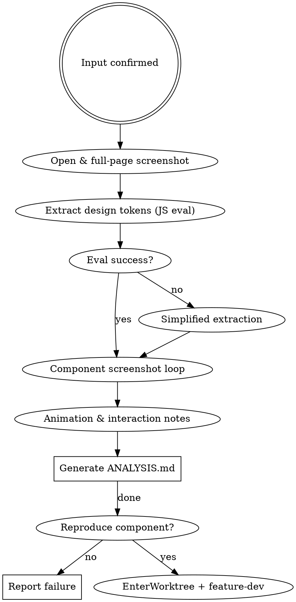

# Website Design Analysis Skill

Analyze a target website to extract design tokens (colors, typography, spacing) and capture component screenshots. Optionally reproduce a specific component in an isolated worktree.

## Iron Law

1. Analysis and reference only. Do not redistribute copyrighted assets.
2. Always confirm scope (analyze-only vs. reproduce) before starting.

## Execution Flow



## Step 1: Confirm Input

Ask the user for:
- URL of the target site
- Analysis goal: which aspects? (`colors` / `typography` / `layout` / `components` / `all`)
- Output directory (default: `/tmp/clone-{domain}/`)

Create the output directory before proceeding:
```bash
mkdir -p /tmp/clone-DOMAIN/components
```

## Step 2: Open & Full-Page Screenshot

```bash
agent-browser open TARGET_URL
agent-browser wait 'body'
agent-browser screenshot /tmp/clone-DOMAIN/full-page.png
```

- The `agent-browser` command is resolved via a mise shim. No need to hardcode the path.
- Pass `--session <unique-name>` when running in parallel subagents to avoid state mixing.

## Step 3: Extract Design Tokens via JS Eval

Run the following JS with `agent-browser eval`:

```javascript
(() => {
  const els = [...document.querySelectorAll('*')];
  const get = (el, prop) => getComputedStyle(el).getPropertyValue(prop).trim();

  // Colors: collect unique non-transparent backgrounds + text colors
  const colors = new Set();
  els.slice(0, 200).forEach(el => {
    ['background-color', 'color', 'border-color'].forEach(p => {
      const v = get(el, p);
      if (v && v !== 'rgba(0, 0, 0, 0)' && v !== 'transparent') colors.add(v);
    });
  });

  // Typography
  const fonts = new Set();
  const sizes = new Set();
  els.slice(0, 200).forEach(el => {
    fonts.add(get(el, 'font-family'));
    sizes.add(get(el, 'font-size'));
  });

  // Spacing
  const radii = new Set();
  els.slice(0, 200).forEach(el => {
    const r = get(el, 'border-radius');
    if (r && r !== '0px') radii.add(r);
  });

  return JSON.stringify({
    colors: [...colors].slice(0, 30),
    fontFamilies: [...fonts].filter(Boolean).slice(0, 10),
    fontSizes: [...sizes].filter(Boolean).slice(0, 15),
    borderRadii: [...radii].slice(0, 10),
    pageTitle: document.title,
    metaDescription: document.querySelector('meta[name="description"]')?.content || ''
  }, null, 2);
})()
```

### Fallback for Step 3

If `agent-browser eval` fails, use Chrome MCP: `mcp__chrome-devtools__evaluate_script`.

## Step 4: Component Screenshot Loop

Identify key sections and capture each one:

```bash
# Example: scroll to section and screenshot
agent-browser eval 'document.querySelector("nav").scrollIntoView()'
agent-browser screenshot /tmp/clone-DOMAIN/nav.png

agent-browser eval 'document.querySelector("footer").scrollIntoView()'
agent-browser screenshot /tmp/clone-DOMAIN/footer.png
```

Target sections (capture as many as exist): `nav`, `hero`, `cards`, `features`, `testimonials`, `footer`.
Save component screenshots under `/tmp/clone-DOMAIN/components/` when there are multiple variants.

## Step 5: Animation & Interaction Notes

Run the following JS with `agent-browser eval` to record transition and animation patterns:

```javascript
(() => {
  const sheets = [...document.styleSheets];
  const transitions = [];
  const animations = [];
  try {
    sheets.forEach(s => {
      [...(s.cssRules || [])].forEach(r => {
        if (r.style?.transition) transitions.push(r.selectorText + ': ' + r.style.transition);
        if (r.style?.animation) animations.push(r.selectorText + ': ' + r.style.animation);
      });
    });
  } catch (e) {}
  return JSON.stringify({
    transitions: transitions.slice(0, 10),
    animations: animations.slice(0, 10)
  }, null, 2);
})()
```

## Step 6: Generate Analysis Report

Write `/tmp/clone-{domain}/ANALYSIS.md` with the following structure:

```
# Design Analysis: {pageTitle}

**URL:** TARGET_URL
**Meta:** {metaDescription}

## Color Palette

| Value | Type |
|-------|------|
| ... | background / text / border |

## Typography

| Font Family | Sizes Observed |
|-------------|----------------|
| ...         | ...            |

## Border Radius

| Value |
|-------|
| ...   |

## Key Components

| Component | Screenshot |
|-----------|------------|
| nav       | nav.png    |
| hero      | hero.png   |
| ...       | ...        |

## Animation & Transitions

(list transitions and animations found)

## Design Pattern Observations

- Grid system: ...
- Card patterns: ...
- CTA style: ...
- (add observations)
```

## Step 7: (Optional) Reproduce Component

If the user wants to build a specific component after analysis:

1. Use `EnterWorktree` to create an isolated branch.
2. Launch `feature-dev:code-architect` with the component screenshots and extracted design tokens as context.
3. Delegate implementation to an `implementer` subagent.
4. Browser-test the result with `agent-browser`.

## Output Structure

```
/tmp/clone-{domain}/
├── full-page.png
├── nav.png
├── hero.png
├── footer.png
├── components/
│   └── *.png
└── ANALYSIS.md
```

## Error Handling

| Error | Action |
|-------|--------|
| `agent-browser` not found | Fall back to playwright-cli or Playwright MCP |
| JS eval returns empty | Try simplified extraction (colors only) |
| Screenshot fails | Note failure in ANALYSIS.md, continue with other sections |
| CORS/CSP blocks JS | Document limitation, use visual analysis only |
| Page requires login | Report to user — analysis limited to publicly visible content |
