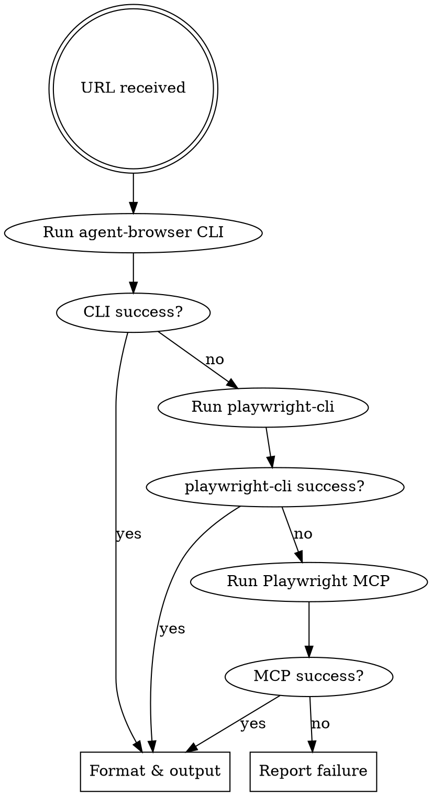

# X Post Fetching Skill

Extract data from X post URLs. Fallback order: agent-browser CLI → playwright-cli → Playwright MCP.

## Iron Law

1. Do not guess post content when a post cannot be fetched

## Execution Flow



## Extraction Logic (JS)

Use the same code for agent-browser `eval` and Playwright MCP `browser_run_code`.

```javascript
(() => {
  const a = document.querySelector("article");
  if (!a) return JSON.stringify({ error: "article not found" });
  const userLines = a.querySelector('[data-testid="User-Name"]')?.innerText.split("\n") ?? [];
  return JSON.stringify({
    userName: userLines[0] || "",
    userHandle: userLines.find(s => s.startsWith("@")) || "",
    text: a.querySelector('[data-testid="tweetText"]')?.innerText || "",
    timestamp: a.querySelector("time")?.getAttribute("datetime") || "",
    displayTime: a.querySelector("time")?.innerText || "",
    engagement: {
      replies: a.querySelector('[data-testid="reply"]')?.getAttribute("aria-label") || "",
      retweets: a.querySelector('[data-testid="retweet"]')?.getAttribute("aria-label") || "",
      likes: a.querySelector('[data-testid="like"]')?.getAttribute("aria-label") || "",
    },
    media: {
      type: a.querySelector('[data-testid="videoPlayer"]') ? "video"
          : a.querySelector('[data-testid="tweetPhoto"]') ? "image" : "none",
    }
  }, null, 2);
})()
```

## Step 1: agent-browser CLI (preferred)

Run the following for each URL. Multiple URLs can be run in parallel (separate Bash calls).

```bash
agent-browser open TARGET_URL
agent-browser wait '[data-testid="tweetText"]'
agent-browser eval 'extraction logic (JS)'
# When the post has images
agent-browser screenshot /tmp/x_post_image.png
agent-browser close
```

- The `agent-browser` command is resolved via a mise shim. No need to hardcode the path.
- When using `snapshot`, always pass `-i -c` for compact output (reduces token consumption by ~16%).
- When fetching multiple posts in parallel subagents, pass `--session <unique-name>` per agent to avoid state mixing.
- The daemon persists, so when fetching multiple posts in sequence, use `open` to navigate to the next URL and `close` only at the end.

## Step 2: playwright-cli (fallback)

Use only if Step 1 fails (`command not found`, non-zero exit code, or `error` key in result).

```bash
playwright-cli open TARGET_URL
playwright-cli eval 'extraction logic (JS)'
playwright-cli close
```

## Step 3: Playwright MCP (last resort)

Use only if Step 2 also fails.

```
1. mcp__playwright__browser_navigate → TARGET_URL
2. mcp__playwright__browser_run_code → run extraction logic (JS)
3. mcp__playwright__browser_close → close session (required)
```

## Step 4: Format and Output

If image → display `/tmp/x_post_image.png` with Read. If video → metadata only.

```
**Author:** {userName} ({userHandle})
**Time:** {displayTime}
**Text:**
{text}

**Engagement:** Replies {replies} / Reposts {retweets} / Likes {likes}
**Media:** {type}
```

## Error Handling

| Error | Action |
|--------|------|
| `article not found` | Check the URL or retry |
| `command not found: agent-browser` | Fall back to Step 2 (playwright-cli) |
| `command not found: playwright-cli` | Fall back to Step 3 (Playwright MCP) |
| Timeout | Increase the `agent-browser wait` timeout and retry |

## Limitations

- Public posts only (cannot fetch posts that require login)
- Videos return metadata only
- Reply chains return the main post only
