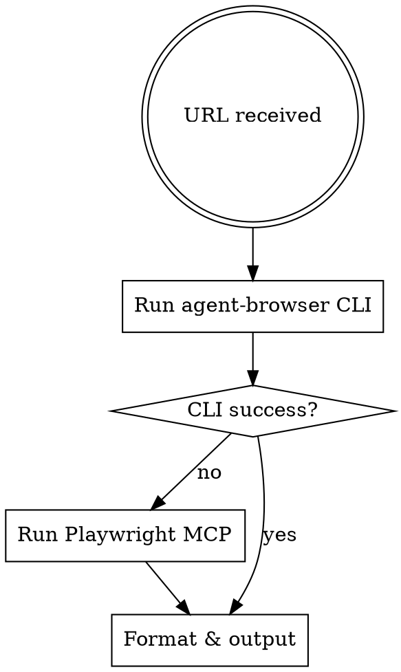

# X投稿取得スキル

X投稿URLからデータを抽出する。agent-browser CLI を優先し、失敗時のみ Playwright MCP にフォールバック。

## 実行フロー



## 抽出ロジック（JS）

agent-browser `eval` および Playwright MCP `browser_run_code` で同一コードを使う。

```javascript
(() => {
  const a = document.querySelector("article");
  if (!a) return JSON.stringify({ error: "article not found" });
  const userLines = a.querySelector('[data-testid="User-Name"]')?.innerText.split("\n") ?? [];
  return JSON.stringify({
    userName: userLines[0] || "",
    userHandle: userLines.find(s => s.startsWith("@")) || "",
    text: a.querySelector('[data-testid="tweetText"]')?.innerText || "",
    timestamp: a.querySelector("time")?.getAttribute("datetime") || "",
    displayTime: a.querySelector("time")?.innerText || "",
    engagement: {
      replies: a.querySelector('[data-testid="reply"]')?.getAttribute("aria-label") || "",
      retweets: a.querySelector('[data-testid="retweet"]')?.getAttribute("aria-label") || "",
      likes: a.querySelector('[data-testid="like"]')?.getAttribute("aria-label") || "",
    },
    media: {
      type: a.querySelector('[data-testid="videoPlayer"]') ? "video"
          : a.querySelector('[data-testid="tweetPhoto"]') ? "image" : "none",
    }
  }, null, 2);
})()
```

## Step 1: agent-browser CLI方式（優先）

各URLに対して以下を実行する。複数URLは並列実行可能（別々のBash呼び出し）。

```bash
agent-browser open TARGET_URL
agent-browser wait '[data-testid="tweetText"]'
agent-browser eval '抽出ロジック（JS）'
# 画像付きの場合
agent-browser screenshot /tmp/x_post_image.png
agent-browser close
```

- `agent-browser` コマンドは mise の shim 経由で解決される。パスのハードコード不要
- デーモンが永続化するため、複数投稿を連続取得する場合は `open` で次のURLに遷移し、最後に `close` する

## Step 2: Playwright MCP方式（フォールバック）

Step 1 が失敗した場合（`command not found`、終了コード非0、`error` キー）のみ使用。

```
1. mcp__playwright__browser_navigate → TARGET_URL
2. mcp__playwright__browser_run_code → 抽出ロジック（JS）を実行
3. mcp__playwright__browser_close → セッション閉じる（必須）
```

## Step 3: 結果の整形と出力

画像あり → Read で `/tmp/x_post_image.png` を表示。動画 → メタデータのみ。

```
**投稿者:** {userName} ({userHandle})
**日時:** {displayTime}
**本文:**
{text}

**エンゲージメント:** 返信{replies} / リポスト{retweets} / いいね{likes}
**メディア:** {type}
```

## エラーハンドリング

| エラー | 対応 |
|--------|------|
| `article not found` | URL確認 or 再試行 |
| `command not found: agent-browser` | Step 2 にフォールバック |
| タイムアウト | `agent-browser wait` のタイムアウトを増やして再試行 |

## 制限事項

- 公開投稿のみ（ログイン要求の投稿は取得不可）
- 動画はメタデータのみ
- リプライチェーンはメイン投稿のみ
