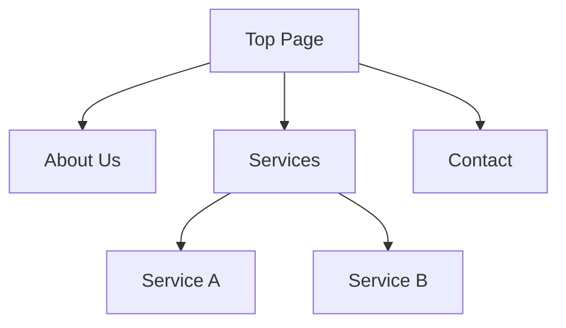

# Website Structure Analysis and Wireframe Creation

## Overview

Crawl a website from a given URL and create a sitemap, wireframes, and content analysis.

## Iron Law

1. Do not access pages that require authentication without permission.
2. Do not fill in site structure based on guesswork.

## Confirm Input Information

At the start of the skill, confirm the following:

### 1. Target URL

- Get the top page URL.
- Identify the domain (used to restrict the crawl scope).

### 2. Crawl Depth

Ask the user:

- **1 level**: Only pages linked directly from the top page.
- **2 levels**: Top page + one level below it.
- **3 levels or more**: Specify as needed.
- **Specific pages only**: Manually specify a list of URLs.

### 3. Sitemap Output Format (multiple selections allowed)

- **Mermaid diagram**: Visualize the hierarchy as a tree diagram.
- **Markdown list**: Structure with indented list.
- **JSON**: A format easy to use programmatically.

### 4. Wireframe Output Format (multiple selections allowed)

- **Markdown + ASCII**: Text-based and lightweight.
- **HTML/CSS**: Actual wireframe that can be viewed in a browser.

### 5. Content Analysis (optional)

- **None**: Wireframe only.
- **Basic analysis**: Page purpose, target audience, key messages.
- **Detailed analysis**: Per-section purpose, summary, keywords, and improvement suggestions.

### 6. Design Analysis (optional)

- **None**: Do not extract.
- **Basic analysis**: Color palette and typography.
- **Detailed analysis**: Basic + spacing + sizes + CSS variable output.

## Execution Flow

### Step 1: Site Crawl

```text
mcp__plugin_playwright_playwright__browser_navigate
```

1. Access the top page.
2. Extract links on the page.
3. Filter links to the same domain.
4. Crawl recursively to the specified depth.

**Excluded items:**

- Links to external domains.
- Anchor links (starting with #).
- `mailto:`, `tel:`, `javascript:`, etc.
- File links such as images and PDFs.
- Duplicate URLs.

### Step 2: Get Page Structure

Run the following on each page:

```text
mcp__plugin_playwright_playwright__browser_snapshot
```

Information to extract from the snapshot:

- Header structure (h1–h6)
- Navigation elements
- Main content area
- Sidebar
- Footer
- Form elements
- Buttons and links
- Image areas

### Step 3: Generate Sitemap

#### Mermaid format



#### Markdown format

```markdown
- Top Page (/)
  - About Us (/about)
  - Services (/services)
    - Service A (/services/a)
    - Service B (/services/b)
  - Contact (/contact)
```

#### JSON format

```json
{
  "url": "/",
  "title": "Top Page",
  "children": [
    {
      "url": "/about",
      "title": "About Us",
      "children": []
    }
  ]
}
```

### Step 4: Generate Wireframes

#### Markdown + ASCII format

```markdown
## Page Name: Top Page
URL: https://example.com/

### Layout Structure

┌─────────────────────────────────────────┐
│ [HEADER]                                │
│ ┌─────┐ ┌─────────────────────────────┐ │
│ │Logo │ │ Nav: Home | About | Contact │ │
│ └─────┘ └─────────────────────────────┘ │
├─────────────────────────────────────────┤
│ [HERO]                                  │
│ ┌─────────────────────────────────────┐ │
│ │ H1: Main Headline                   │ │
│ │ P: Sub-text description             │ │
│ │ [CTA Button]                        │ │
│ └─────────────────────────────────────┘ │
├─────────────────────────────────────────┤
│ [MAIN CONTENT]                          │
│ ┌───────────┐ ┌───────────┐ ┌─────────┐ │
│ │ Card 1    │ │ Card 2    │ │ Card 3  │ │
│ │ [Image]   │ │ [Image]   │ │ [Image] │ │
│ │ Title     │ │ Title     │ │ Title   │ │
│ │ Text      │ │ Text      │ │ Text    │ │
│ └───────────┘ └───────────┘ └─────────┘ │
├─────────────────────────────────────────┤
│ [FOOTER]                                │
│ Copyright | Links | SNS Icons           │
└─────────────────────────────────────────┘

### Element List

| Area | Element | Content |
|--------|------|------|
| Header | Logo | Company logo |
| Header | Nav | 5-item navigation |
| Hero | H1 | Main headline |
| Hero | Button | "Learn more" CTA |
| Main | Cards | 3-column cards |
```

#### HTML/CSS format

Generate a simple HTML wireframe:

- Grayscale color scheme.
- Boxes to represent elements.
- Labels to indicate element types.
- Basic responsive support.

### Step 5: Extract Design Elements (optional)

When design analysis is selected, use `browser_evaluate` or `browser_run_code` to get the page's computed styles:

#### Items to extract

| Category | Items to get |
|----------|----------|
| **Colors** | background-color, color, border-color, main accent colors |
| **Fonts** | font-family, font-size, font-weight, line-height |
| **Spacing** | margin, padding (per major component) |
| **Sizes** | width, height (main sections, cards, etc.) |

#### Implementation

```javascript
// Get computed styles for all elements
const elements = document.querySelectorAll('*');
const colors = new Set();
const fonts = new Map();
const spacing = new Set();

elements.forEach(el => {
  const styles = window.getComputedStyle(el);

  // Extract colors
  const bgColor = styles.backgroundColor;
  const textColor = styles.color;
  const borderColor = styles.borderColor;
  if (bgColor && bgColor !== 'rgba(0, 0, 0, 0)') colors.add(bgColor);
  if (textColor) colors.add(textColor);
  if (borderColor && borderColor !== 'rgb(0, 0, 0)') colors.add(borderColor);

  // Extract fonts
  const fontKey = `${styles.fontFamily}|${styles.fontSize}|${styles.fontWeight}`;
  fonts.set(fontKey, {
    family: styles.fontFamily,
    size: styles.fontSize,
    weight: styles.fontWeight,
    lineHeight: styles.lineHeight
  });

  // Extract spacing
  const margin = [styles.marginTop, styles.marginRight, styles.marginBottom, styles.marginLeft];
  const padding = [styles.paddingTop, styles.paddingRight, styles.paddingBottom, styles.paddingLeft];
  margin.forEach(val => { if (val !== '0px') spacing.add(val); });
  padding.forEach(val => { if (val !== '0px') spacing.add(val); });
});
```

#### Output format

**Basic analysis:**
- Color palette list (HEX/RGB format)
- Typography list (font families and size scale)

**Detailed analysis:**
- Everything in basic analysis
- Spacing list (spacing values in use)
- Size information for major elements
- Output as CSS variables (design tokens)

### Step 6: Content Analysis (optional)

When content analysis is selected, generate the following:

#### Basic analysis

```markdown
## Content Analysis Summary

### Page Purpose
[The goal the page is trying to achieve]

### Target Users
[Assumed readers and users]

### Key Message
> [The core message the page wants to convey]
```

#### Detailed analysis

```markdown
## Content Analysis Summary

### Page Purpose
[The goal the page is trying to achieve]

### Target Users
- [User 1]
- [User 2]

### Key Message
> [The core message the page wants to convey]

---

## Per-Section Content Analysis

### 1. [Section Name]
| Item | Content |
|------|------|
| **Purpose** | The role of this section |
| **Content Summary** | Summary of the content (50-100 characters) |
| **Keywords** | Important keywords |
| **CTA** | Call-to-action content |
| **Differentiator** | Difference from competitors (if any) |

### 2. [Section Name]
...

---

## Insights and Improvement Suggestions

### Strengths
- [Good point 1]
- [Good point 2]

### Potential Improvements
- [Improvement suggestion 1]
- [Improvement suggestion 2]

### UX Perspective
- [Observations on user experience]
```

#### Analysis criteria

Evaluate content from these perspectives:

1. **Clarity of purpose**: Is the page's purpose clear?
2. **Target fit**: Is the content suitable for the intended users?
3. **Message consistency**: Is the message consistent?
4. **CTA effectiveness**: Is the call-to-action appropriate?
5. **Information structure**: Is the information organized?
6. **Differentiation**: Does it communicate differences from competitors?
7. **Credibility**: Are there numbers, results, or third-party endorsements?

### Step 7: Output

Output files in the specified format:

```
output/
├── sitemap.md              # Sitemap (Mermaid)
├── sitemap.json            # Sitemap (JSON)
├── wireframes/
│   ├── index.md            # Top page
│   ├── about.md            # About Us
│   └── ...
├── wireframes-analyzed/    # With analysis (when detailed analysis is selected)
│   ├── index.md
│   └── ...
├── wireframes-html/        # HTML format
│   ├── index.html
│   └── ...
└── design-analysis/        # Design analysis (when selected)
    ├── design-system.md    # Integrated design report
    └── design-tokens.css   # CSS variables (detailed analysis only)
```

## Notes

- **Pages requiring authentication**: Cannot crawl. Only public pages are supported.
- **SPA (Single Page Application)**: Only the initial render can be captured.
- **Dynamic content**: The state at the time of the snapshot is captured.
- **robots.txt**: Respect it. Skip paths marked as disallowed.
- **Rate limiting**: Add a reasonable wait between pages (1-2 seconds).
- **Large sites**: Set a page limit (default: 20 pages).

## Output Directory

Ask the user, or create `wireframe-output/` in the project root by default.

## Quick Start Example

```
"Analyze https://example.com"

→ Confirm the following:
1. Crawl depth: 1 level
2. Sitemap: Mermaid
3. Wireframe: Markdown + ASCII
4. Content analysis: Detailed analysis

→ Output:
- sitemap.md
- wireframes/*.md (layout + with analysis)
- design-analysis/design-system.md (design element report)
```

## Status

Add one of the following at the end of every response:
- `## Status: DONE` — sitemap and wireframes generated and saved in the requested formats
- `## Status: DONE_WITH_CONCERNS` — analysis complete but some pages were skipped (e.g., auth-required pages, crawl limit reached, robots.txt restrictions)
- `## Status: BLOCKED` — cannot proceed (e.g., target URL is unreachable or requires authentication for all pages)
- `## Status: NEEDS_CONTEXT` — no URL provided, or crawl depth / output format not confirmed
